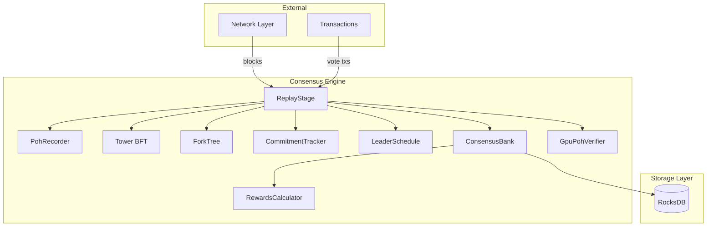
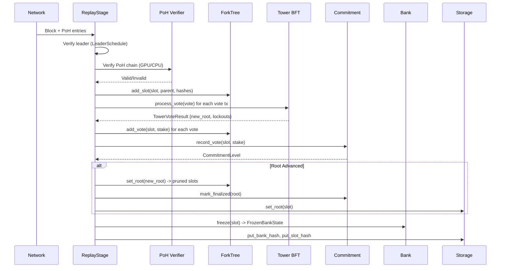
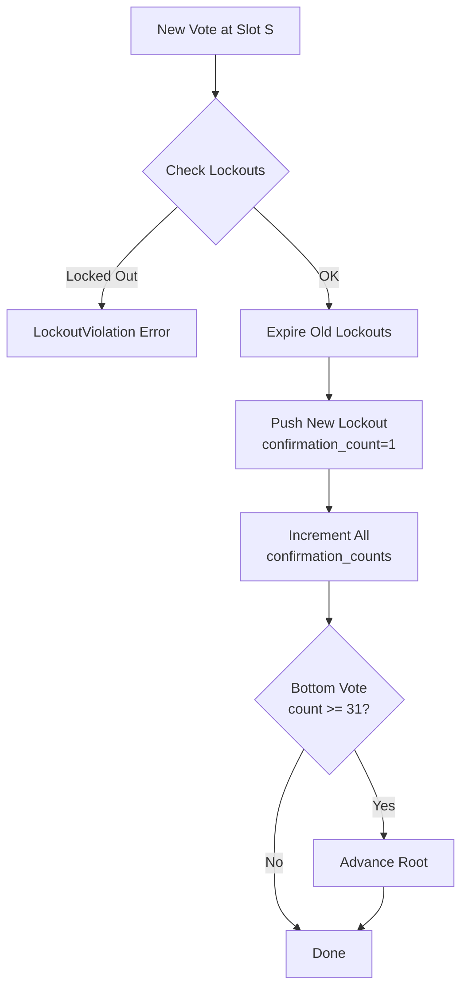
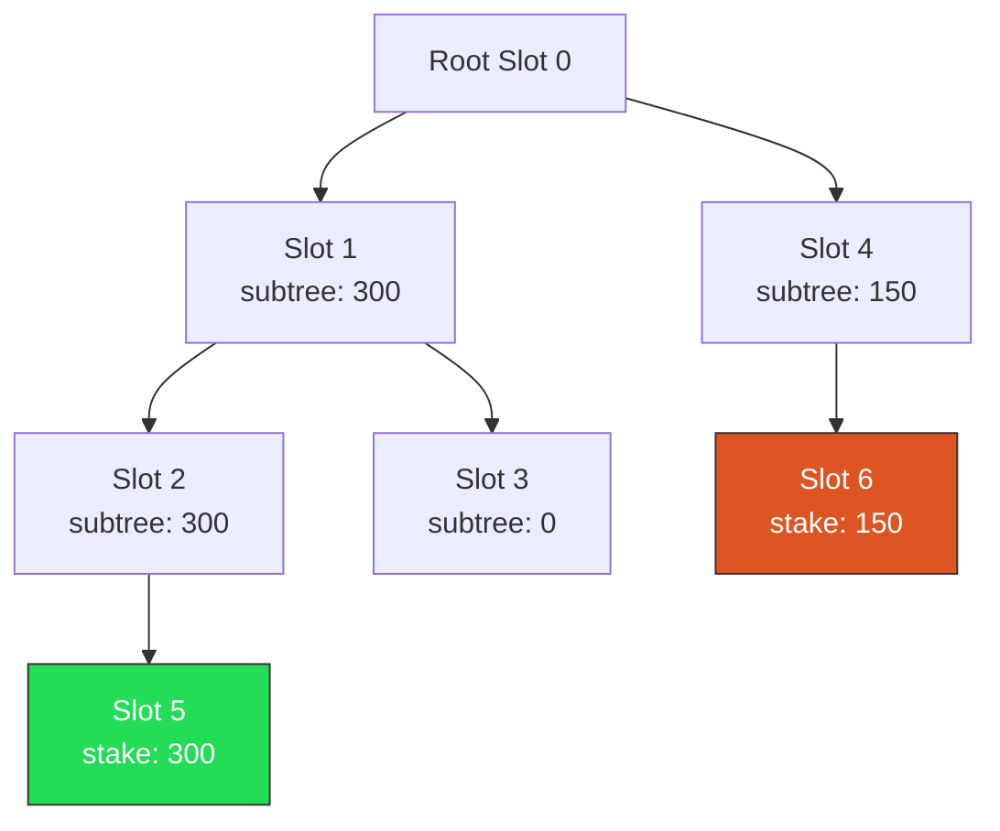
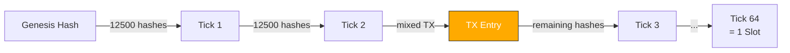
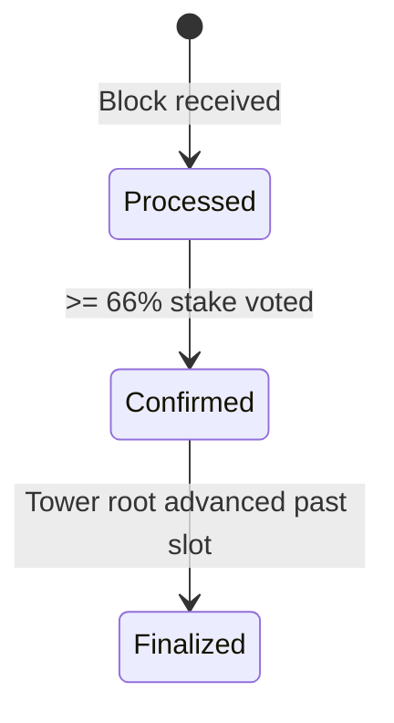
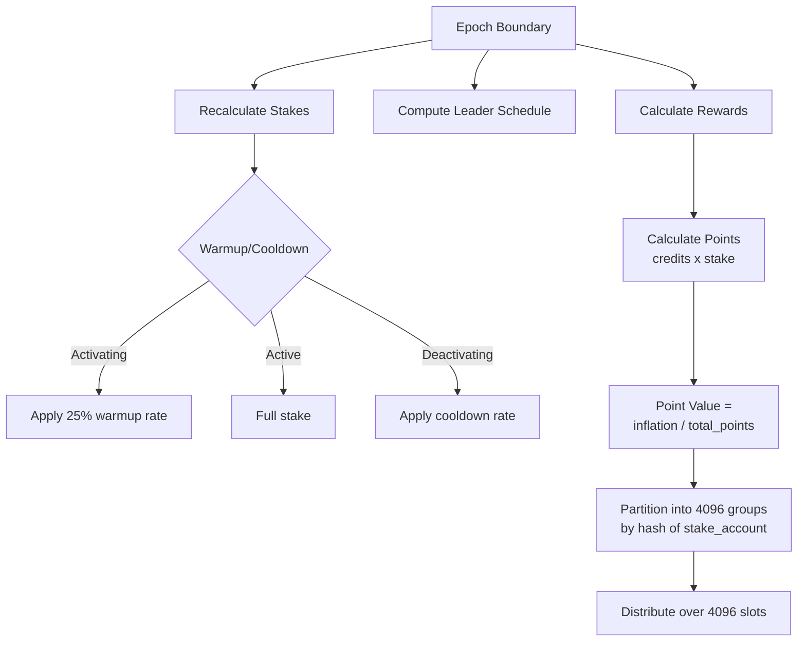
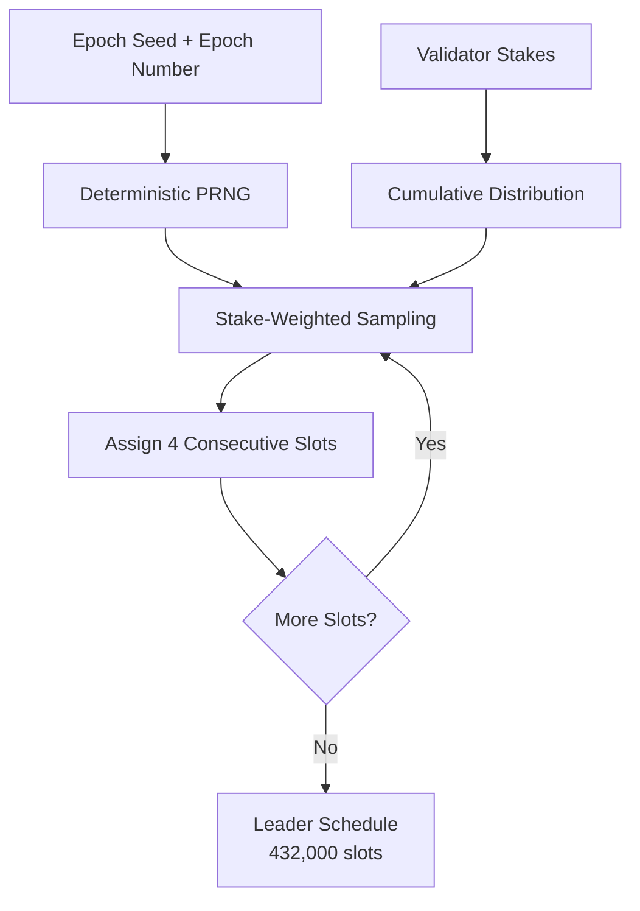

# Consensus Architecture

## System Overview

## Module Interactions

### Block Replay Flow

### Tower BFT Voting

Each lockout has a slot and confirmation_count. The lockout duration is `2^confirmation_count` slots. A vote at slot S is locked out until `slot + 2^confirmation_count`. After 31 confirmations, the vote becomes a finalized root.

### Fork Choice Algorithm

The heaviest subtree fork choice walks the tree from root, always choosing the child with the highest cumulative subtree stake. In the example above, the best fork is `0 -> 1 -> 2 -> 5` with 300 total stake.

### Proof of History Chain

- **Pure hash**: `hash = SHA3-512(hash)` repeated N times
- **Transaction mixin**: `hash = SHA3-512(hash || tx_hash)` — proves TX existed at this point
- **Tick**: After `HASHES_PER_TICK` (12,500) iterations
- **Slot**: After `TICKS_PER_SLOT` (64) ticks = 800,000 total hashes

### Commitment Levels

- **Processed**: Block has been received and validated
- **Confirmed**: Supermajority (66%) of stake has voted for this slot
- **Finalized**: Tower root has advanced past this slot (irreversible)

### Epoch Boundary & Rewards

### Leader Schedule Generation

## Data Flow Summary

| Component | Input | Output | Persistence |
|-----------|-------|--------|-------------|
| PohRecorder | Previous hash | Ticks, entries | None (in-memory) |
| Tower | Vote | Root advancement, lockouts | VoteState (Borsh) |
| ForkTree | Slot, parent, votes | Best fork, pruned slots | None (in-memory) |
| LeaderSchedule | Stakes, epoch seed | Slot-to-leader mapping | None (cached) |
| ConsensusBank | Storage, epoch schedule | Vote/stake caches | RocksDB |
| CommitmentTracker | Votes, stake | Commitment levels | None (in-memory) |
| RewardsCalculator | Vote states, delegations | Partitioned rewards | None (computed) |
| GpuPohVerifier | PoH entries | Verification results | None |
| ReplayStage | Blocks | Replay results | RocksDB (via Bank) |
