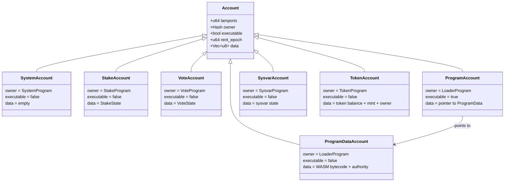

# Account Model

Nusantara uses an account-based state model where all on-chain state is stored in
accounts. Every account is owned by exactly one program, and only that program
may modify the account's data.

## Account Structure

Every account in Nusantara has the following fields:

| Field | Type | Description |
|-------|------|-------------|
| lamports | u64 | Balance in lamports (1 NUSA = 1,000,000,000 lamports) |
| owner | Hash | Program that owns this account |
| executable | bool | Whether this account contains executable code |
| rent_epoch | u64 | Next epoch when rent will be collected |
| data | Vec\<u8\> | Arbitrary binary data (Borsh-serialized program state) |

---

## Account Types



### System Accounts

The default account type. Owned by the system program, holds a NUSA balance, and
has no data. Every new account starts as a system account before being assigned
to another program.

### Stake Accounts

Owned by the stake program. Data contains `StakeState` which tracks:

- Delegated validator identity
- Activation/deactivation epoch
- Stake amount and warmup/cooldown credits
- Withdrawal authority and stake authority

### Vote Accounts

Owned by the vote program. Data contains `VoteState` which tracks:

- Validator identity and authorized voter
- Vote history (recent tower votes)
- Commission rate (0--100%)
- Root slot and epoch credits

### Program Accounts

Marked `executable = true`, owned by the loader program. The data field contains
a pointer (hash) to the corresponding `ProgramData` account. This indirection
allows programs to be upgraded without changing their address.

### ProgramData Accounts

Owned by the loader program. Data contains:

- Upgrade authority (Option\<Hash\> --- None means immutable)
- WASM bytecode (up to 512 KiB)
- Last deployed slot

### Sysvar Accounts

Owned by the sysvar program. Store cluster-wide state that programs can read.
See the Sysvar Accounts section below.

### Token Accounts

Owned by the token program (SPL-like). Store token balances, mint references,
and per-account authorities.

---

## Account Identification

### Hash-Based Addresses

The primary addressing scheme. An account's address is the SHA3-512 hash of its
public key, producing a 64-byte identifier. Displayed to users in Base64
URL-safe no-pad encoding.

### Named Accounts

Human-readable addresses in the format `name.nusantara`. Naming rules:

- Each segment must be 2--63 characters long
- Allowed characters: `a-z`, `0-9`, `-`, `_`
- Must not start or end with `-` or `_`
- The `.nusantara` suffix is required

Named accounts are resolved by hashing the name string to derive the address.

### Program Derived Addresses (PDAs)

Deterministic addresses derived from a set of seeds and a program ID. PDAs are
used by programs to create accounts at predictable addresses without requiring a
private key.

```
PDA = SHA3-512(seeds... + program_id + "ProgramDerivedAddress")
```

PDAs are guaranteed to have no corresponding private key because they are derived
via SHA3-512 hash derivation (no curve involved). Only the owning program can sign
on their behalf via `invoke_signed`.

---

## Sysvar Accounts

Sysvars are special accounts maintained by the runtime that expose cluster state
to programs. They are updated automatically at the start of each slot.

### Clock

Provides current time and slot information.

| Field | Type | Description |
|-------|------|-------------|
| slot | u64 | Current slot number |
| epoch | u64 | Current epoch number |
| unix_timestamp | i64 | Estimated Unix timestamp |
| leader_schedule_epoch | u64 | Epoch for which leader schedule is available |

### Rent

Defines rent parameters.

| Field | Type | Description |
|-------|------|-------------|
| lamports_per_byte_year | u64 | Annual rent cost per byte of data |
| exemption_threshold | f64 | Years of rent to be exempt (2.0) |
| burn_percentage | u8 | Percentage of collected rent burned |

### EpochSchedule

Defines epoch boundaries.

| Field | Type | Description |
|-------|------|-------------|
| slots_per_epoch | u64 | Number of slots in each epoch (432,000) |
| leader_schedule_slot_offset | u64 | Slots before epoch to compute leader schedule |
| warmup | bool | Whether epoch warmup is enabled |

### SlotHashes

A vector of the most recent 512 `(slot, Hash)` pairs. Programs use this to
verify that a referenced slot actually existed and to obtain its bank hash.

### StakeHistory

Historical record of stake activation and deactivation across epochs. Used by
the stake program to compute warmup and cooldown rates.

### RecentBlockhashes

A vector of the most recent 300 blockhashes. Transactions reference a recent
blockhash to prove they were created recently and to prevent replay. A
transaction referencing a blockhash not in this list is rejected as expired.

---

## Rent Model

Accounts consume storage space on every validator. Rent is the mechanism that
prevents unbounded state growth.

### Rent-Exempt Minimum

An account is **rent-exempt** if its lamport balance covers at least 2 years of
rent:

```
rent_exempt_minimum = (account_data_size + 128) * lamports_per_byte_year * 2
```

The 128-byte overhead accounts for the account metadata (lamports, owner,
executable flag, rent_epoch).

### Rent Collection

- Accounts below the rent-exempt minimum are charged rent at the start of each
  epoch based on their data size.
- If an account's balance reaches zero from rent collection, the account is
  purged from state.
- **Best practice:** All accounts should be created with at least the rent-exempt
  minimum. The system program's `CreateAccount` instruction enforces this.

### Implications for Programs

- Programs must ensure newly created accounts are funded with enough lamports
  to be rent-exempt.
- The `Rent` sysvar provides `minimum_balance(data_len)` to calculate the
  required amount.
- Account data resizing (growing) requires additional lamports to maintain
  rent exemption.

---

## Account Ownership Rules

Account ownership enforces a strict security model:

1. **Only the owner program can modify account data.** If program A owns an
   account, only program A's instructions can write to that account's `data`
   field.

2. **Only the owner program can debit lamports.** A program can decrease the
   lamport balance of accounts it owns (e.g., the system program processes
   transfers).

3. **Anyone can credit lamports.** Any program can increase an account's lamport
   balance (e.g., receiving a transfer).

4. **Only the system program can assign owners.** Changing an account's `owner`
   field requires a system program instruction. This prevents programs from
   hijacking accounts.

5. **Only the system program can allocate data.** Growing an account's data
   field (increasing its size) requires a system program instruction.

6. **New accounts are zero-initialized.** When the system program creates an
   account, the data field is filled with zeros up to the requested size.

### Ownership Transfer Flow

```
User creates account (system program owns it, data = empty)
  |
  v
User calls system program: Assign { owner: StakeProgram }
  |
  v
Account is now owned by StakeProgram
  |
  v
StakeProgram can now write to account data
System program can no longer write to account data
```

---

## State Consistency

Account state is always consistent within a slot:

- All account modifications within a transaction are applied atomically.
- If a transaction fails, all account changes are rolled back (except the fee
  deduction from the payer).
- The bank hash at each slot is computed over all account states, providing a
  cryptographic commitment to the entire state.
- Validators that disagree on bank hashes will fork, and the fork choice rule
  will resolve the conflict.
