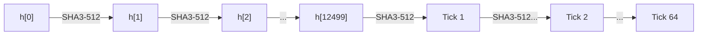

# Block Production

The block producer pipeline and Proof of History (PoH) hash chain that together
form the core of Nusantara's slot-based block creation.

---

## Slot Timing

Every block occupies exactly one slot. Timing is derived from the genesis
creation time and a fixed slot duration.

| Parameter | Value | Source |
|-----------|-------|--------|
| Slot duration | 400ms | `core/config.toml` (`slot_duration_ms`) |
| Ticks per slot | 64 | `consensus/config.toml` (`ticks_per_slot`) |
| Hashes per tick | 12,500 | `consensus/config.toml` (`hashes_per_tick`) |
| Target tick duration | 14.062us | `consensus/config.toml` (`target_tick_duration_us`) |
| Total hashes per slot | 800,000 | 64 * 12,500 |
| Slots per epoch | 432,000 | `core/config.toml` (`slots_per_epoch`) |
| Epoch duration | ~2 days | 432,000 * 0.4s |

The `SlotClock` computes the current slot from wall-clock time:

```
current_slot = (now_ms - genesis_creation_time_ms) / slot_duration_ms
```

---

## Block Producer Pipeline

`BlockProducer::produce_block()` is the main entry point, called once per slot
with the pending transactions. The pipeline executes 16 sequential steps:


### Step 1: advance_slot

Update the `ConsensusBank`'s Clock sysvar to reflect the new slot:

- `clock.slot` = current slot
- `clock.unix_timestamp` = current wall-clock timestamp
- `clock.epoch` = epoch number for this slot
- `clock.leader_schedule_epoch` = epoch + 1

### Step 2: Build SysvarCache

Snapshot all sysvar state into an immutable `SysvarCache` for the duration of
this slot's execution:

| Sysvar | Description |
|--------|-------------|
| `Clock` | Current slot, epoch, timestamp |
| `Rent` | Rent parameters (exemption threshold, burn percentage) |
| `EpochSchedule` | Slots per epoch, leader schedule offset |
| `SlotHashes` | Recent (slot, hash) pairs (up to 512) |
| `StakeHistory` | Historical effective stake per epoch |
| `RecentBlockhashes` | Recent blockhashes for transaction validation (up to 300) |

The `SysvarCache` is immutable within a slot. Transactions cannot observe
changes made by other transactions in the same slot to sysvar state.

### Step 3: execute_slot_parallel

Sealevel-style parallel runtime execution. Transactions that touch disjoint
account sets can execute concurrently. The runtime:

1. Verifies signatures (Dilithium3)
2. Parses compute budgets
3. Calculates fees (`lamports_per_signature` = 5,000)
4. Loads accounts from storage
5. Executes instructions via native program dispatch
6. Applies account deltas
7. Deducts fees from payer (even on failure)

Returns an `ExecutionResult` containing:
- `account_deltas` -- all modified (address, Account) pairs
- `account_delta_hash` -- hash of all state changes
- `transactions_executed` / `transactions_succeeded` / `transactions_failed`
- `total_fees` -- total fees collected

### Step 4: update_state_tree

Feed account deltas into the incremental `StateTree` (Merkle tree over all
account state). This produces the `state_root` hash included in the block header.

### Step 5: Record Transaction Hashes in PoH

For each transaction, mix its hash into the PoH chain:

```
poh_hash = SHA3-512(poh_hash || tx_hash)
```

This anchors every transaction in the verifiable time sequence.

### Step 6: produce_slot (PoH Ticks)

Grind 64 ticks of 12,500 SHA3-512 hashes each (800,000 total). Each tick
advances the PoH chain independently of transactions:

```
for _ in 0..12500:
    poh_hash = SHA3-512(poh_hash)
```

The final `poh_hash` after all ticks is recorded in the block header.

### Step 7: Compute merkle_root

Build a Merkle tree from all transaction hashes in the block. If the block
contains no transactions, `merkle_root = Hash::zero()`.

This root enables compact transaction inclusion proofs.

### Step 8: Compute block_hash

The block's identity hash is derived from three inputs:

```
block_hash = hashv([parent_hash, slot.to_le_bytes(), poh_hash])
```

This makes each block's hash dependent on its parent (chain integrity),
its slot position, and the PoH output (verifiable ordering).

### Step 9: freeze

Compute the `bank_hash` and lock the bank state for this slot:

```
bank_hash = hashv([parent_bank_hash, account_delta_hash])
```

Returns a `FrozenBankState` containing slot, parent_slot, block_hash,
bank_hash, epoch, and transaction_count.

### Step 10: Assemble Block

Construct the `Block` from `BlockHeader` + transactions:

```rust
Block {
    header: BlockHeader {
        slot, parent_slot, parent_hash, block_hash, timestamp,
        validator, transaction_count, merkle_root, poh_hash,
        bank_hash, state_root,
    },
    transactions,
}
```

### Step 11: put_block

Persist the complete block to RocksDB storage.

### Step 12: put_slot_meta

Store slot metadata:

```rust
SlotMeta {
    slot, parent_slot, block_time, num_data_shreds,
    num_code_shreds, is_connected, completed,
}
```

### Step 13: record_slot_hash

Update the consensus bank's `SlotHashes` sysvar with the new (slot, block_hash)
entry. The sysvar retains up to 512 recent entries.

### Step 14: flush_to_storage

Persist the frozen bank state to RocksDB:
- `put_bank_hash(slot, bank_hash)` -- for state verification
- `put_slot_hash(slot, block_hash)` -- for block lookup

### Step 15: Root Advancement

Handled by Tower BFT via `ReplayStage`. When the oldest vote in the tower
reaches `MAX_LOCKOUT_HISTORY` (31) confirmations, the corresponding slot becomes
the finalized root.

### Step 16: Update Parent Pointers

Advance internal state for the next slot:
- `parent_slot` = current slot
- `parent_hash` = current block_hash
- `parent_bank_hash` = current bank_hash
- `poh.reset(block_hash)` -- start new PoH chain from block_hash

---

## Proof of History (PoH) Detail

PoH is a verifiable delay function (VDF) based on sequential SHA3-512 hashing.
It provides a cryptographic proof that time has passed between two events.

### Hash Chain



**Pure hash chain** (tick grinding):
```
h[n+1] = SHA3-512(h[n])
```

**Transaction mixin** (interleaved between ticks):
```
h[n+1] = SHA3-512(h[n] || tx_hash)
```

**Tick**: a sequence of 12,500 consecutive hashes without a mixin. Each tick
represents one PoH entry with a cumulative hash count.

**Slot**: 64 ticks with interleaved transaction mixins. The total hash count
for a complete slot is 800,000.

### PohRecorder

The `PohRecorder` maintains the running PoH state:

| Method | Description |
|--------|-------------|
| `hash_iterations(count)` | Grind `count` sequential SHA3-512 hashes |
| `record(tx_hash)` | Mix in a transaction hash: `h = SHA3-512(h \|\| tx_hash)` |
| `tick()` | Emit a tick after completing `HASHES_PER_TICK` iterations |
| `produce_slot()` | Produce 64 ticks (one complete slot) |
| `reset(hash)` | Reset state at slot boundary |

### Verification

PoH entries form a chain that any validator can verify:

**CPU verification** (`verify_poh_entries`):
Replay the hash chain from the initial hash through each entry, comparing
intermediate hashes against the recorded values. Any mismatch indicates
tampering.

**CPU chain verification** (`verify_poh_chain`):
Verify a sequence of (num_hashes, optional_mixin, expected_hash) tuples.
Pre-mixin hashes are ground sequentially, then the mixin is applied if present.

### GPU PoH Verification

For batch verification, a WGSL compute shader parallelizes PoH entry checking
across GPU workgroups via wgpu:

- Each GPU workgroup verifies one PoH entry independently
- Entry format: 136 bytes (initial_hash[64] + num_hashes[8] + expected_hash[64])
- Results: u32 per entry (1 = valid, 0 = invalid)
- Falls back to CPU if no GPU adapter is available

```
GpuPohVerifier::new()     -- Initialize wgpu device + compile WGSL shader
GpuPohVerifier::verify_batch(&entries) -- Batch verify on GPU
```

The `ReplayStage` automatically uses GPU verification when available and falls
back to CPU on failure or absence.

---

## Critical Hashes

Every block contains multiple hashes serving different purposes:

| Hash | Derivation | Purpose |
|------|------------|---------|
| `nusantara_poh_hash` | End of PoH chain for slot (800,000 sequential SHA3-512 hashes) | Verifiable passage of time |
| `merkle_root` | MerkleTree of all transaction hashes in the block | Transaction inclusion proof |
| `block_hash` | `hashv([parent_hash, slot_le_bytes, poh_hash])` | Block identity, chain linkage |
| `account_delta_hash` | Hash of all account state changes in the slot | State transition integrity |
| `nusantara_bank_hash` | `hashv([parent_bank_hash, account_delta_hash])` | Full cumulative state digest |
| `state_root` | Root of incremental Merkle tree over all accounts | State proof root for light clients |

### Hash Dependency Graph

```
parent_hash ----+
                |
slot (le bytes)-+---> block_hash
                |
poh_hash -------+

parent_bank_hash ----+
                     +---> bank_hash
account_delta_hash --+

[all account states] ---> state_root (Merkle tree)

[all tx hashes] ---> merkle_root (Merkle tree)
```

---

## BlockHeader Structure

The `BlockHeader` is Borsh-serialized and included in every block:

```rust
pub struct BlockHeader {
    pub slot: u64,               // Slot number
    pub parent_slot: u64,        // Parent block's slot
    pub parent_hash: Hash,       // Parent block's block_hash
    pub block_hash: Hash,        // This block's identity hash
    pub timestamp: i64,          // Unix timestamp (seconds)
    pub validator: Hash,         // Leader identity (hash of public key)
    pub transaction_count: u64,  // Number of transactions in block
    pub merkle_root: Hash,       // Merkle root of transaction hashes
    pub poh_hash: Hash,          // Final PoH hash for this slot
    pub bank_hash: Hash,         // Cumulative state hash
    pub state_root: Hash,        // Merkle root of all account state
}
```

---

## Metrics

Metrics emitted during block production:

| Metric | Type | Description |
|--------|------|-------------|
| `nusantara_blocks_produced` | Counter | Total blocks produced |
| `nusantara_parallel_execution_blocks` | Counter | Blocks executed via parallel runtime |
| `nusantara_current_slot` | Gauge | Current slot number |
| `nusantara_block_time_ms` | Histogram | Time to produce a block (ms) |
| `nusantara_transactions_per_slot` | Gauge | Transactions in the latest slot |
| `nusantara_state_tree_leaves` | Gauge | Number of accounts in state tree |
| `nusantara_poh_hash_iterations_total` | Counter | Total PoH hash iterations |
| `nusantara_poh_records_total` | Counter | Transaction hashes mixed into PoH |
| `nusantara_poh_ticks_total` | Counter | PoH ticks produced |
| `nusantara_poh_slots_produced_total` | Counter | PoH slots produced |
| `nusantara_gpu_poh_entries_verified_total` | Counter | PoH entries verified on GPU |
| `nusantara_bank_slots_frozen_total` | Counter | Slots frozen in consensus bank |

---

## Empty Slots

When no transactions are pending for a slot, the `BlockProducer` still produces
a block:

- `transaction_count` = 0
- `merkle_root` = `Hash::zero()`
- PoH chain still advances (64 ticks, 800,000 hashes)
- The block is stored and broadcast normally
- This maintains the continuous PoH chain and slot sequence
