# Nusantara Blockchain -- Crate Dependency Graph

This document catalogs all 29 crates in the Nusantara workspace, groups them by
domain, and visualizes their internal dependency relationships.

---

## Table of Contents

1. [Crate Catalog](#crate-catalog)
2. [Domain Groups](#domain-groups)
3. [Full Dependency Graph](#full-dependency-graph)
4. [Dependency Details by Domain](#dependency-details-by-domain)

---

## Crate Catalog

| # | Crate Directory | Package Name | Category | Description |
|---|----------------|--------------|----------|-------------|
| 1 | `crypto/` | `nusantara-crypto` | Cryptography | SHA3-512 hashing, Dilithium3 signatures, Base64 encoding, account IDs |
| 2 | `core/` | `nusantara-core` | Core | Block, Transaction, Account types, compile-time config constants |
| 3 | `system-program/` | `nusantara-system-program` | Program | Account creation, NUSA transfers, space allocation |
| 4 | `rent-program/` | `nusantara-rent-program` | Program | Rent calculation, exemption minimum balance |
| 5 | `compute-budget-program/` | `nusantara-compute-budget-program` | Program | Per-transaction compute unit limits and heap size |
| 6 | `sysvar-program/` | `nusantara-sysvar-program` | Program | Clock, Rent, SlotHashes, EpochSchedule, StakeHistory sysvars |
| 7 | `stake-program/` | `nusantara-stake-program` | Program | Stake delegation, activation, deactivation, withdrawal |
| 8 | `vote-program/` | `nusantara-vote-program` | Program | Validator vote accounts and Tower BFT vote recording |
| 9 | `loader-program/` | `nusantara-loader-program` | Program | WASM program deployment, upgrade, and close |
| 10 | `token-program/` | `nusantara-token-program` | Program | SPL-style fungible token mints, accounts, and transfers |
| 11 | `storage/` | `nusantara-storage` | Storage | RocksDB backend with 17 column families, account index, snapshots |
| 12 | `consensus/` | `nusantara-consensus` | Consensus | PoH, Tower BFT, fork choice, leader schedule, rewards, GPU verification |
| 13 | `runtime/` | `nusantara-runtime` | Execution | Transaction execution, compute metering, batch executor |
| 14 | `vm/` | `nusantara-vm` | Execution | wasmi WASM interpreter, fuel metering, LRU program cache |
| 15 | `genesis/` | `nusantara-genesis` | Infrastructure | Slot-0 state builder from TOML configuration |
| 16 | `validator/` | `nusantara-validator` | Infrastructure | Orchestrator binary: boot, slot loop, shutdown |
| 17 | `gossip/` | `nusantara-gossip` | Networking | CRDS-based UDP gossip for peer discovery and protocol data |
| 18 | `turbine/` | `nusantara-turbine` | Networking | Shred-based block propagation with Reed-Solomon erasure coding |
| 19 | `tpu-forward/` | `nusantara-tpu-forward` | Networking | QUIC transaction ingress, rate limiting, leader forwarding |
| 20 | `mempool/` | `nusantara-mempool` | Networking | Priority-ordered transaction buffer with validation |
| 21 | `rpc/` | `nusantara-rpc` | API | Axum REST API (16 endpoints), OpenAPI/Swagger UI, TLS |
| 22 | `cli/` | `nusantara-cli` | Application | `nusantara` binary: keygen, transfers, staking, voting, config |
| 23 | `sdk/` | `nusantara-sdk` | SDK | Smart contract authoring library (Borsh, PDA derivation) |
| 24 | `sdk-macro/` | `nusantara-sdk-macro` | SDK | Procedural macros for contract boilerplate generation |
| 25 | `token-program/` | `nusantara-token-program` | Program | SPL-style token program |
| 26 | `mempool/` | `nusantara-mempool` | Networking | Transaction priority queue |
| 27 | `e2e-tests/` | `nusantara-e2e-tests` | Testing | End-to-end integration tests and TPS benchmark binary |

> **Note:** 29 workspace members total. Some entries above are grouped; see the
> domain breakdown below for the complete, deduplicated list.

---

## Domain Groups

### Cryptography
- **crypto** -- No internal dependencies. Foundation for all other crates.

### Core
- **core** -- Depends on `crypto`.

### Programs (8 crates)
All programs depend on `crypto` + `core`:
- **system-program** -- `crypto`, `core`
- **rent-program** -- `crypto`, `core`
- **compute-budget-program** -- `crypto`, `core`
- **sysvar-program** -- `crypto`, `core`, `rent-program`
- **stake-program** -- `crypto`, `core`
- **vote-program** -- `crypto`, `core`
- **loader-program** -- `crypto`, `core`
- **token-program** -- `crypto`, `core`

### Storage
- **storage** -- `crypto`, `core`, `sysvar-program`

### Consensus
- **consensus** -- `crypto`, `core`, `vote-program`, `stake-program`, `sysvar-program`, `storage`

### Execution (2 crates)
- **vm** -- `crypto`, `core`
- **runtime** -- `crypto`, `core`, `system-program`, `rent-program`, `compute-budget-program`, `sysvar-program`, `stake-program`, `vote-program`, `storage`, `vm`, `loader-program`, `token-program`

### Networking (4 crates)
- **gossip** -- `crypto`, `core`
- **turbine** -- `crypto`, `core`, `storage`, `consensus`, `gossip`
- **tpu-forward** -- `crypto`, `core`, `gossip`, `consensus`
- **mempool** -- `crypto`, `core`, `compute-budget-program`, `runtime`

### Infrastructure (2 crates)
- **genesis** -- `crypto`, `core`, `rent-program`, `sysvar-program`, `stake-program`, `vote-program`, `storage`
- **validator** -- `crypto`, `core`, `storage`, `consensus`, `runtime`, `genesis`, `rent-program`, `sysvar-program`, `stake-program`, `vote-program`, `gossip`, `turbine`, `tpu-forward`, `rpc`, `mempool`

### API
- **rpc** -- `crypto`, `core`, `storage`, `consensus`, `system-program`, `stake-program`, `vote-program`, `sysvar-program`, `loader-program`, `gossip`, `mempool`

### Application
- **cli** -- `crypto`, `core`, `system-program`, `stake-program`, `vote-program`, `rpc`, `loader-program`

### SDK (2 crates)
- **sdk-macro** -- No internal dependencies (proc-macro crate: `proc-macro2`, `quote`, `syn`)
- **sdk** -- `sdk-macro` only (plus `sha3` on native targets for PDA derivation)

### Testing
- **e2e-tests** -- `crypto`, `core`, `system-program`, `compute-budget-program`

---

## Full Dependency Graph

The graph below shows all internal (workspace) dependency edges. Arrows point from
dependent to dependency (bottom-to-top: dependents are lower, foundations are higher).

```mermaid
flowchart BT
    subgraph Cryptography ["Cryptography"]
        crypto["crypto"]
    end

    subgraph Core ["Core"]
        core["core"]
    end

    subgraph Programs ["Native Programs"]
        system["system-program"]
        rent["rent-program"]
        cb["compute-budget-program"]
        sysvar["sysvar-program"]
        stake["stake-program"]
        vote["vote-program"]
        loader["loader-program"]
        token["token-program"]
    end

    subgraph StorageGroup ["Storage"]
        storage["storage"]
    end

    subgraph ConsensusGroup ["Consensus"]
        consensus["consensus"]
    end

    subgraph ExecutionGroup ["Execution"]
        vm["vm"]
        runtime["runtime"]
    end

    subgraph NetworkingGroup ["Networking"]
        gossip["gossip"]
        turbine["turbine"]
        tpu["tpu-forward"]
        mempool["mempool"]
    end

    subgraph InfraGroup ["Infrastructure"]
        genesis["genesis"]
        validator["validator"]
    end

    subgraph APIGroup ["API"]
        rpc["rpc"]
    end

    subgraph AppGroup ["Application"]
        cli["cli"]
    end

    subgraph SDKGroup ["SDK"]
        sdk_macro["sdk-macro"]
        sdk["sdk"]
    end

    subgraph TestGroup ["Testing"]
        e2e["e2e-tests"]
    end

    %% Core depends on crypto
    core --> crypto

    %% Programs depend on crypto + core
    system --> crypto
    system --> core
    rent --> crypto
    rent --> core
    cb --> crypto
    cb --> core
    sysvar --> crypto
    sysvar --> core
    sysvar --> rent
    stake --> crypto
    stake --> core
    vote --> crypto
    vote --> core
    loader --> crypto
    loader --> core
    token --> crypto
    token --> core

    %% Storage
    storage --> crypto
    storage --> core
    storage --> sysvar

    %% Consensus
    consensus --> crypto
    consensus --> core
    consensus --> vote
    consensus --> stake
    consensus --> sysvar
    consensus --> storage

    %% Execution
    vm --> crypto
    vm --> core
    runtime --> crypto
    runtime --> core
    runtime --> system
    runtime --> rent
    runtime --> cb
    runtime --> sysvar
    runtime --> stake
    runtime --> vote
    runtime --> storage
    runtime --> vm
    runtime --> loader
    runtime --> token

    %% Networking
    gossip --> crypto
    gossip --> core
    turbine --> crypto
    turbine --> core
    turbine --> storage
    turbine --> consensus
    turbine --> gossip
    tpu --> crypto
    tpu --> core
    tpu --> gossip
    tpu --> consensus
    mempool --> crypto
    mempool --> core
    mempool --> cb
    mempool --> runtime

    %% Infrastructure
    genesis --> crypto
    genesis --> core
    genesis --> rent
    genesis --> sysvar
    genesis --> stake
    genesis --> vote
    genesis --> storage

    validator --> crypto
    validator --> core
    validator --> storage
    validator --> consensus
    validator --> runtime
    validator --> genesis
    validator --> rent
    validator --> sysvar
    validator --> stake
    validator --> vote
    validator --> gossip
    validator --> turbine
    validator --> tpu
    validator --> rpc
    validator --> mempool

    %% API
    rpc --> crypto
    rpc --> core
    rpc --> storage
    rpc --> consensus
    rpc --> system
    rpc --> stake
    rpc --> vote
    rpc --> sysvar
    rpc --> loader
    rpc --> gossip
    rpc --> mempool

    %% Application
    cli --> crypto
    cli --> core
    cli --> system
    cli --> stake
    cli --> vote
    cli --> rpc
    cli --> loader

    %% SDK
    sdk --> sdk_macro

    %% Testing
    e2e --> crypto
    e2e --> core
    e2e --> system
    e2e --> cb
```



---

## Dependency Details by Domain

### Cryptography: `crypto`

```
nusantara-crypto
  External: sha3, pqcrypto-dilithium, pqcrypto-traits, base64, borsh, thiserror, zeroize
  Internal: (none -- leaf crate)
```

Zero internal dependencies. This is the root of the entire dependency tree.

### Core: `core`

```
nusantara-core
  External: borsh, thiserror
  Internal: crypto
```

Depends only on `crypto`. Provides the type vocabulary (Block, Transaction, Account,
Instruction, Message) and build-time config constants used by every other crate.

### Programs

All eight programs share a minimal dependency footprint:

```
system-program, rent-program, compute-budget-program,
stake-program, vote-program, loader-program, token-program
  External: borsh, thiserror
  Internal: crypto, core

sysvar-program (exception)
  External: borsh, thiserror
  Internal: crypto, core, rent-program
```

`sysvar-program` is the only program with a cross-program dependency: it imports
`rent-program` to compute the rent sysvar values.

### Storage: `storage`

```
nusantara-storage
  External: rocksdb, borsh, thiserror, tracing, metrics
  Internal: crypto, core, sysvar-program
```

Depends on `sysvar-program` for the generic `Sysvar` trait used to store/load sysvars.

### Consensus: `consensus`

```
nusantara-consensus
  External: sha3, borsh, thiserror, tokio, tracing, metrics, wgpu, bytemuck, pollster, dashmap, parking_lot
  Internal: crypto, core, vote-program, stake-program, sysvar-program, storage
```

Heavy dependency set reflecting its role as the central coordination engine.
GPU dependencies (`wgpu`, `bytemuck`, `pollster`) are for PoH verification acceleration.

### Execution: `vm` and `runtime`

```
nusantara-vm
  External: wasmi, lru, borsh, thiserror, tracing, metrics, parking_lot
  Internal: crypto, core

nusantara-runtime
  External: borsh, thiserror, tracing, metrics, rayon
  Internal: crypto, core, system-program, rent-program, compute-budget-program,
            sysvar-program, stake-program, vote-program, storage, vm,
            loader-program, token-program
```

`runtime` is the widest internal dependency fan-out of any non-binary crate --
it must know about every native program to dispatch instructions.

### Networking: `gossip`, `turbine`, `tpu-forward`, `mempool`

```
nusantara-gossip
  External: borsh, thiserror, tokio, tracing, metrics, dashmap, parking_lot, rand
  Internal: crypto, core

nusantara-turbine
  External: borsh, thiserror, tokio, tracing, metrics, dashmap, reed-solomon-erasure
  Internal: crypto, core, storage, consensus, gossip

nusantara-tpu-forward
  External: borsh, thiserror, tokio, tracing, metrics, dashmap, parking_lot, quinn, rustls, rcgen
  Internal: crypto, core, gossip, consensus

nusantara-mempool
  External: borsh, thiserror, tracing, metrics, parking_lot
  Internal: crypto, core, compute-budget-program, runtime
```

`gossip` is a leaf in this group (depends only on primitives). `turbine` and
`tpu-forward` both depend on `gossip` for peer lookup. `mempool` depends on
`runtime` for transaction pre-validation.

### Infrastructure: `genesis` and `validator`

```
nusantara-genesis
  External: borsh, thiserror, tracing, metrics, serde, toml
  Internal: crypto, core, rent-program, sysvar-program, stake-program, vote-program, storage

nusantara-validator
  External: borsh, thiserror, tokio, tracing, tracing-subscriber, metrics,
            metrics-exporter-prometheus, clap, quinn, rustls, rcgen, parking_lot,
            rand, reqwest, serde, serde_json
  Internal: crypto, core, storage, consensus, runtime, genesis, rent-program,
            sysvar-program, stake-program, vote-program, gossip, turbine,
            tpu-forward, rpc, mempool
```

`validator` is the top-level binary and depends on nearly every crate in the workspace
(15 internal dependencies). It is the only crate that pulls in the Prometheus exporter,
`clap` for CLI argument parsing, and `tracing-subscriber` for log initialization.

### API: `rpc`

```
nusantara-rpc
  External: borsh, thiserror, tokio, tokio-util, tracing, metrics, parking_lot,
            dashmap, serde, serde_json, axum, tower-http, utoipa, utoipa-swagger-ui,
            base64, rustls, tokio-rustls, rustls-pemfile, hyper-util
  Internal: crypto, core, storage, consensus, system-program, stake-program,
            vote-program, sysvar-program, loader-program, gossip, mempool
```

Second-widest external dependency set after `validator`. The web stack (axum, tower-http,
utoipa) and TLS stack (rustls, tokio-rustls) account for most of the weight.

### Application: `cli`

```
nusantara-cli
  External: borsh, thiserror, tokio, clap, serde, serde_json, toml, reqwest, base64, dirs
  Internal: crypto, core, system-program, stake-program, vote-program, rpc, loader-program
```

The `cli` crate depends on `rpc` to share response type definitions (serde-derived
structs). It does not import storage, consensus, or any networking crate directly.

### SDK: `sdk` and `sdk-macro`

```
nusantara-sdk-macro
  External: proc-macro2, quote, syn
  Internal: (none)

nusantara-sdk
  External: borsh, sha3 (native only, conditional on not-wasm32)
  Internal: sdk-macro
```

The SDK pair is intentionally isolated from the rest of the workspace. Contract
authors depend only on `sdk` (which re-exports `sdk-macro`), not on any validator
internals. SHA3 is a native-only dependency used for PDA derivation; in WASM,
the equivalent syscall is used instead.

### Testing: `e2e-tests`

```
nusantara-e2e-tests
  External: borsh, base64, reqwest, tokio, serde, serde_json, thiserror,
            tracing, tracing-subscriber, clap, rand, anyhow
  Internal: crypto, core, system-program, compute-budget-program
```

Intentionally lightweight internal dependencies. E2E tests interact with the
validator via HTTP (reqwest), not by linking against runtime or consensus crates.
Includes a `tps-bench` binary for throughput benchmarking.

---

## Dependency Statistics

| Metric | Count |
|--------|-------|
| Total workspace crates | 29 |
| Internal dependency edges | ~85 |
| Leaf crates (no internal deps) | 3 (`crypto`, `sdk-macro`, `sdk`) |
| Max internal fan-out | `validator` (15 internal deps) |
| Max internal fan-in | `crypto` (depended on by 25+ crates) |
| Crates with `config.toml` + `build.rs` | 11 |
| Crates using `tokio` | 9 |
| Crates using `metrics` | 12 |
| Crates using `tracing` | 11 |
| Crates using `serde` | 5 (`genesis`, `validator`, `rpc`, `cli`, `e2e-tests`) |

---

*Last updated: 2026-03-17*
