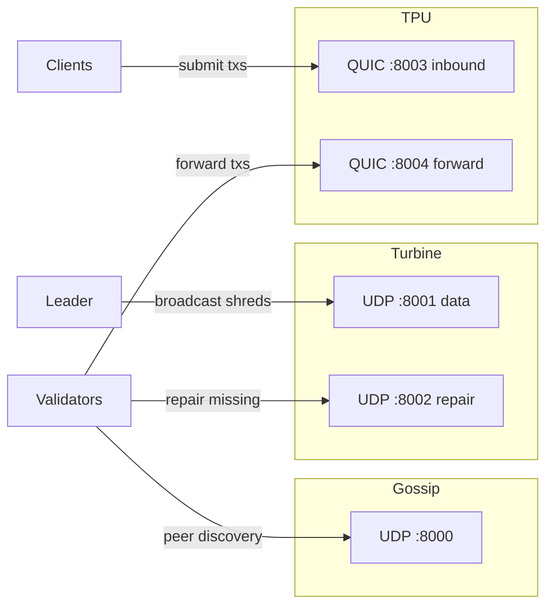
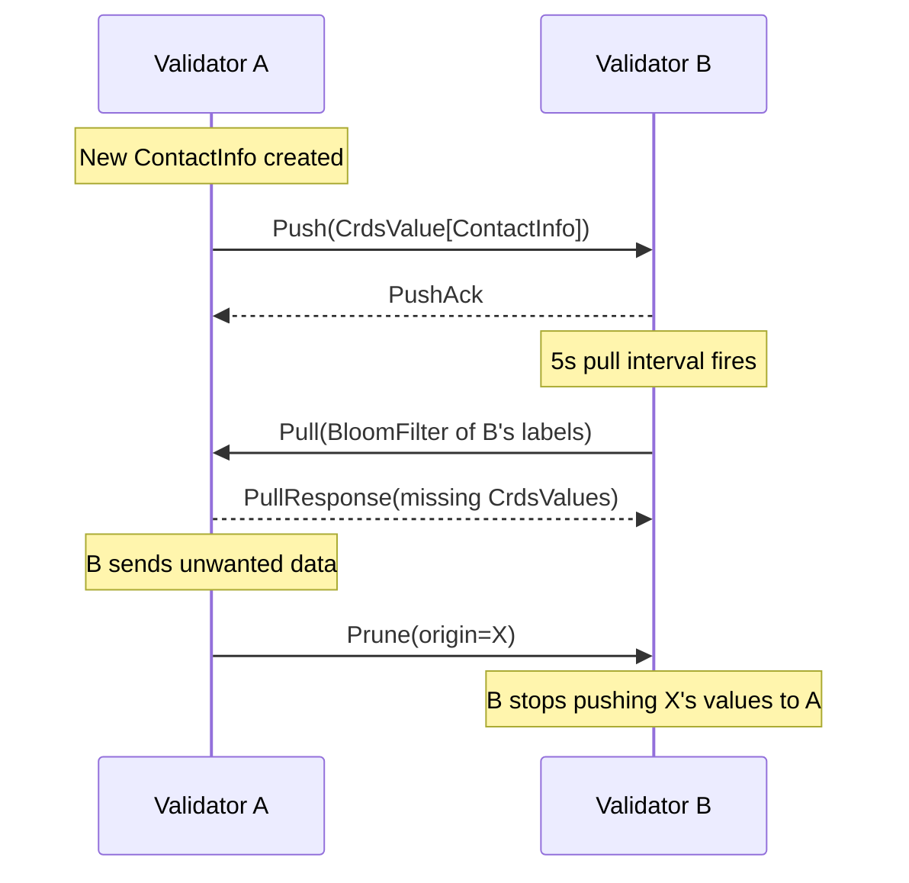
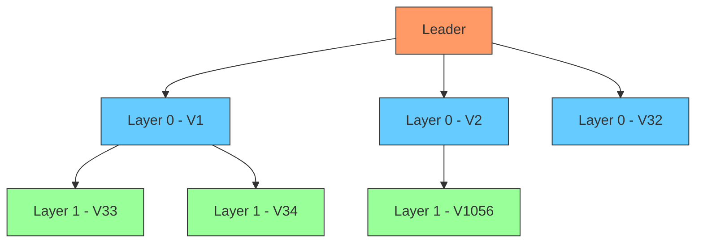

# Networking Protocols

Nusantara validators communicate over three distinct networking protocols, each
optimized for a specific traffic pattern: peer discovery (Gossip), block
propagation (Turbine), and transaction ingress (TPU).

## Network Overview



All wire protocols use **Borsh** encoding. Cryptographic identity is verified at
the application layer using Dilithium3 signatures, not at the transport layer.

---

## Gossip (CRDS)

The gossip protocol implements a Conflict-free Replicated Data Store (CRDS) over
UDP. Every validator continuously exchanges cluster metadata --- contact info,
vote records, epoch slots, and lowest-slot markers --- so that every node
maintains a consistent view of the cluster.

### Data Model

**ContactInfo** is the primary record each validator publishes:

| Field | Type | Description |
|-------|------|-------------|
| identity | Hash | SHA3-512 of the validator's public key |
| pubkey | PublicKey | Dilithium3 public key (1,952 bytes) |
| gossip | SocketAddr | Gossip endpoint (UDP :8000) |
| tpu | SocketAddr | TPU inbound endpoint (QUIC :8003) |
| tpu_forward | SocketAddr | TPU forward endpoint (QUIC :8004) |
| turbine | SocketAddr | Turbine data endpoint (UDP :8001) |
| repair | SocketAddr | Repair endpoint (UDP :8002) |
| shred_version | u16 | Cluster shred version (partition protection) |
| wallclock | u64 | Unix timestamp in milliseconds |

**CrdsData variants:**

| Variant | Description |
|---------|-------------|
| ContactInfo | Validator network addresses and identity |
| Vote | Recent tower vote for a slot |
| EpochSlots | Slots a validator has received in current epoch |
| LowestSlot | Lowest slot a validator still retains |

**CrdsTable** stores all values in a `DashMap<CrdsValueLabel, CrdsEntry>` with a
monotonic insert cursor. Each entry is a `CrdsValue` containing `CrdsData` plus
a Dilithium3 `Signature` from the originating validator.

### Push Protocol

Push disseminates newly-created or newly-received values to a random subset of
peers.

1. Every **100 ms**, the push task collects values inserted since the last push
   cursor.
2. It selects **6 peers** via stake-weighted random sampling (higher-staked
   validators are more likely to be chosen).
3. Each selected peer receives the batch of new values in a single UDP datagram.
4. Peers that do not want certain values send **prune messages** back; the sender
   honors these and stops forwarding those value types to the pruning peer.

**Limits:** `max_crds_values_per_push = 10` values per push message.

### Pull Protocol

Pull fills gaps by requesting values the local node is missing.

1. Every **5 seconds**, the pull task selects a random peer.
2. It builds a **Bloom filter** over all local CRDS labels and sends it to the
   selected peer.
3. The peer responds with values whose labels are *not* in the Bloom filter
   (i.e., values the requester is missing).

**Limits:** `max_pull_response_values = 20` values per pull response.

### Push/Pull Interaction



### Liveness and Purging

- **PingCache:** Each peer is pinged periodically. A peer that has not responded
  within **60 seconds** is considered dead and removed from the active peer set.
- **Purge:** Values with a wallclock older than **30 seconds** are removed from
  the CrdsTable during the periodic purge sweep.

### GossipService

`GossipService` spawns **4 tokio tasks** plus an initial entrypoint pull:

| Task | Interval | Responsibility |
|------|----------|----------------|
| recv | continuous | Receive and dispatch incoming UDP messages |
| push | 100 ms | Collect new values and push to peers |
| pull | 5 s | Build bloom filter and pull from a random peer |
| purge | 30 s | Remove stale values from CrdsTable |

On startup, the service performs an immediate pull against configured
**entrypoint** addresses to bootstrap the local CRDS with cluster state.

### Configuration Summary

| Parameter | Value |
|-----------|-------|
| push_interval | 100 ms |
| pull_interval | 5 s |
| fanout | 6 |
| purge_timeout | 30 s |
| ping_cache_ttl | 60 s |
| max_crds_values_per_push | 10 |
| max_pull_response_values | 20 |

---

## Turbine (Block Propagation)

Turbine is a shred-based block propagation protocol inspired by BitTorrent.
Instead of broadcasting an entire block to every validator, the leader splits the
block into small shreds and fans them out through a layered tree. Each validator
retransmits to the next layer, achieving O(log N) propagation latency.

### Shredding Pipeline

```
Block (Borsh bytes)
  |
  v
Split into 1,228-byte chunks --> DataShred[]
  |
  v
FEC encode in groups of 32 --> CodeShred[] (33% redundancy)
  |
  v
Sign each shred with leader's Dilithium3 key --> SignedDataShred / SignedCodeShred
```

1. The block is serialized with Borsh.
2. The byte stream is divided into fixed **1,228-byte** data chunks, each
   becoming a `DataShred`.
3. Data shreds are grouped into FEC sets of 32. Each set is Reed-Solomon encoded
   with **33% redundancy** (galois_8 backend), producing `CodeShred` parity
   shreds.
4. Every shred is signed by the leader: `SignedShred = DataShred/CodeShred +
   leader Hash + Dilithium3 Signature`.

### Turbine Tree

The tree determines which validators retransmit to which. It is computed
deterministically from the leader schedule and stake distribution for each slot.



- **Fanout:** 32 validators per layer.
- **Layer 0:** The leader sends shreds to 32 validators selected by
  stake-weighted deterministic shuffle.
- **Layer 1:** Each Layer-0 validator retransmits to 32 Layer-1 validators.
- **Layer N:** Continues until all validators are covered.
- Shuffle is seeded by the slot number, so the tree changes every slot.

### Shred Collection and Reassembly

`ShredCollector` maintains a `DashMap<slot, SlotShreds>`. When a data shred
arrives:

1. Insert into the slot's shred set.
2. If all data shreds for the slot are present, concatenate their payloads in
   index order and Borsh-deserialize to recover the `Block`.
3. If some data shreds are missing but enough code shreds are present, run
   Reed-Solomon recovery first, then reassemble.

### Repair Service

When a validator detects missing shreds (gaps in the index sequence), the repair
service requests them directly from peers:

- **Interval:** 200 ms
- **Batch size:** Up to 256 shred requests per repair cycle
- Requests are sent to the originating validator's repair socket (UDP :8002)

### Configuration Summary

| Parameter | Value |
|-----------|-------|
| fanout | 32 |
| max_data_per_shred | 1,228 bytes |
| fec_rate | 33% |
| repair_interval | 200 ms |
| max_shreds_per_slot | 32,768 |
| max_repair_batch_request | 256 |

---

## TPU (Transaction Processing Unit)

The TPU is the transaction ingress pipeline. Clients submit transactions over
QUIC, where they are validated, rate-limited, and either processed locally (if
this validator is the current leader) or forwarded to the leader.

### QUIC Server

The TPU server uses the **quinn** crate for QUIC transport:

- **TLS:** Self-signed certificates generated at startup via `rcgen`. TLS
  certificate verification is intentionally skipped
  (`SkipServerVerification`) because validator identity is verified at the
  application layer using Dilithium3 signatures, not X.509.
- **Rate limiting:** A two-tier token bucket enforces per-IP and global limits.
- **Validation:** Only structural validation is performed at ingress (correct
  Borsh deserialization, message size checks). Signature verification happens
  later in the runtime pipeline.

### Rate Limits

| Limit | Value |
|-------|-------|
| max_connections_per_ip | 8 |
| max_tx_per_second_per_ip | 100 |
| max_tx_per_second_global | 50,000 |
| max_transaction_size | 65,536 bytes |
| quic_max_concurrent_streams | 1,024 |

### Wire Protocol

`TpuMessage` is the top-level envelope, Borsh-encoded:

```
TpuMessage {
    Transaction(Transaction),
    TransactionBatch(Vec<Transaction>),
}
```

Clients may send individual transactions or batches. Batches are unpacked and
each transaction is processed independently.

### Connection Cache

`TpuQuicClient` maintains a `DashMap<SocketAddr, Arc<Connection>>` so that
repeated forwards to the same leader reuse an existing QUIC connection instead of
completing a new handshake each time.

### Transaction Forwarding

`TransactionForwarder` decides where each transaction goes:

- **If this validator is the current leader:** Transactions are sent to the
  local mempool channel for immediate execution.
- **Otherwise:** Transactions are batched (up to **64** per batch, flushed every
  **10 ms**) and forwarded over QUIC to the current leader's TPU forward port.

Leader determination uses the `LeaderSchedule` from the consensus layer and
peer addresses from the gossip `ClusterInfo`.

### TpuService

`TpuService` orchestrates the server and forwarder:

1. Generate self-signed TLS certificate.
2. Bind QUIC server on `:8003` (inbound) and `:8004` (forward).
3. Spawn receive loop: accept connections, rate-limit, deserialize, validate.
4. Spawn forward loop: batch transactions, determine leader, forward or deliver
   locally.

### Configuration Summary

| Parameter | Value |
|-----------|-------|
| max_connections_per_ip | 8 |
| max_tx_per_second_per_ip | 100 |
| max_tx_per_second_global | 50,000 |
| max_transaction_size | 65,536 bytes |
| forward_batch_size | 64 |
| forward_interval | 10 ms |
| quic_max_concurrent_streams | 1,024 |

---

## Wire Protocols Summary

| Protocol | Port | Transport | Message Type | Encoding |
|----------|------|-----------|--------------|----------|
| Gossip | 8000 | UDP | GossipMessage | Borsh |
| Turbine | 8001 | UDP | TurbineMessage (SignedShreds) | Borsh |
| Repair | 8002 | UDP | RepairRequest / RepairResponse | Borsh |
| TPU | 8003 | QUIC | TpuMessage | Borsh |
| TPU Forward | 8004 | QUIC | TpuMessage | Borsh |

---

## Crate Dependencies

| Crate | Key External Dependencies |
|-------|--------------------------|
| `nusantara-gossip` | tokio, dashmap, parking_lot, rand, borsh, metrics, tracing |
| `nusantara-turbine` | tokio, dashmap, reed-solomon-erasure, borsh, metrics, tracing |
| `nusantara-tpu-forward` | tokio, dashmap, parking_lot, quinn, rustls, rcgen, borsh, metrics, tracing |

All three crates depend on `nusantara-crypto` and `nusantara-core`. Turbine
additionally depends on `nusantara-storage`, `nusantara-consensus`, and
`nusantara-gossip`. TPU Forward depends on `nusantara-gossip` and
`nusantara-consensus`.
