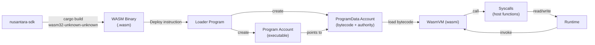

# Smart Contracts

Nusantara supports on-chain programs compiled to WebAssembly (WASM). Programs are
deployed through the loader program, executed in a sandboxed WASM interpreter,
and interact with accounts and the runtime through a defined set of syscalls.

## Architecture



---

## WASM VM

Nusantara uses **wasmi 0.42**, a safe WASM interpreter written in pure Rust. It
provides deterministic execution without JIT compilation, making it suitable for
consensus-critical computation where every validator must produce identical
results.

### Execution Constraints

| Parameter | Limit |
|-----------|-------|
| Max bytecode size | 512 KiB |
| Max memory | 64 pages (4 MiB) |
| Max call stack depth | 256 |
| Max CPI depth | 4 |
| Program cache (LRU) | 256 entries |
| Floating point | Prohibited (rejected at deploy) |

### Fuel-Based Compute Metering

wasmi's **fuel** mechanism maps directly to Nusantara's compute units. Each WASM
instruction consumes fuel; when fuel is exhausted, execution halts with a
`ComputeBudgetExceeded` error.

The default compute budget per transaction is **200,000 compute units**. Programs
can request a higher budget (up to 1,400,000 CU) via the Compute Budget program.

---

## Compute Unit Costs

Each operation has a fixed compute unit cost:

| Operation | Cost (CU) |
|-----------|-----------|
| Module instantiation | 10,000 |
| Memory page allocation | 1,000 |
| Syscall base cost | 100 |
| Account data read | 100 |
| Account data write | 200 |
| SHA3-512 hash | 300 |
| Signature verification | 2,000 |
| Cross-program invocation (base) | 1,000 |
| Log message | 100 |
| PDA derivation | 1,500 |

These costs are additive. A transaction that invokes a program, reads two
accounts, writes one, and logs a message would consume:

```
10,000 (instantiation)
 + 100 (read account 1)
 + 100 (read account 2)
 + 200 (write account)
 + 100 (log)
= 10,500 CU
```

---

## SDK (`nusantara-sdk`)

The SDK is a **standalone crate** that does not depend on `nusantara-crypto` or
`nusantara-core`. It targets `wasm32-unknown-unknown` and provides everything a
program needs to interact with the Nusantara runtime.

### Modules

| Module | Description |
|--------|-------------|
| `pubkey` | `Pubkey` type (64-byte identifier) |
| `account_info` | `AccountInfo` --- borrowed account data passed to programs |
| `program_error` | `ProgramError` enum for instruction failures |
| `program` | CPI functions (`invoke`, `invoke_signed`) |
| `log` | Logging via `msg!()` macro |
| `sysvar` | Sysvar deserialization helpers |
| `entrypoint` | `entrypoint!()` macro for program entry point |
| `syscall` | Raw syscall declarations (advanced use) |

### Key Types

```rust
/// 64-byte account identifier (SHA3-512 hash)
pub struct Pubkey(pub [u8; 64]);

/// Borrowed reference to an account during instruction execution
pub struct AccountInfo<'a> {
    pub key: &'a Pubkey,
    pub lamports: RefCell<&'a mut u64>,
    pub data: RefCell<&'a mut [u8]>,
    pub owner: &'a Pubkey,
    pub executable: bool,
    pub rent_epoch: u64,
}

/// Result type for program instructions
pub type ProgramResult = Result<(), ProgramError>;

/// Standard error variants
pub enum ProgramError {
    Custom(u32),
    InvalidArgument,
    InvalidInstructionData,
    InvalidAccountData,
    AccountDataTooSmall,
    InsufficientFunds,
    IncorrectProgramId,
    MissingRequiredSignature,
    AccountAlreadyInitialized,
    UninitializedAccount,
    NotEnoughAccountKeys,
    AccountBorrowFailed,
    MaxSeedLengthExceeded,
    InvalidSeeds,
    // ...
}
```

### Prelude

Import everything commonly needed with a single `use` statement:

```rust
use nusantara_sdk::prelude::*;
```

This re-exports `Pubkey`, `AccountInfo`, `ProgramResult`, `ProgramError`,
`entrypoint!`, `msg!`, `invoke`, `invoke_signed`, and Borsh traits.

### Macros

| Macro | Purpose |
|-------|---------|
| `entrypoint!(fn_name)` | Declares the program entry point |
| `msg!(fmt, ...)` | Log a formatted message (calls `nusa_log` syscall) |
| `#[program]` | Attribute macro for program modules (framework-level) |
| `#[derive(Accounts)]` | Derive macro for account validation (framework-level) |

---

## Syscalls (Host Functions)

Syscalls are functions provided by the Nusantara runtime that WASM programs can
call. They bridge the sandbox boundary between the VM and the validator.

| Syscall | Signature | Description |
|---------|-----------|-------------|
| `nusa_log` | `(msg_ptr, msg_len)` | Log a UTF-8 string message |
| `nusa_invoke` | `(instruction_ptr, account_infos_ptr, account_infos_len)` | Cross-program invocation |
| `nusa_invoke_signed` | `(instruction_ptr, account_infos_ptr, account_infos_len, signers_seeds_ptr, signers_seeds_len)` | CPI with PDA signer seeds |
| `nusa_get_clock` | `(out_ptr)` | Read Clock sysvar into buffer |
| `nusa_sha3_512` | `(input_ptr, input_len, out_ptr)` | Compute SHA3-512 hash |
| `nusa_create_program_address` | `(seeds_ptr, seeds_len, program_id_ptr, out_ptr)` | Derive a PDA |

### Cross-Program Invocation (CPI)

Programs can call other programs using `invoke` or `invoke_signed`:

- **`invoke`:** Calls another program, forwarding the caller's signer
  authorities.
- **`invoke_signed`:** Calls another program with additional PDA signers. The
  runtime verifies that the provided seeds derive the expected PDA address.

CPI depth is limited to **4 levels** to prevent stack overflow and excessive
compute consumption.

---

## Program Loader

The loader program manages the lifecycle of on-chain programs. It handles
deployment, upgrades, and authority management.

### Instructions

#### 1. InitializeBuffer

Creates a buffer account for staging bytecode before deployment.

```
InitializeBuffer
```

The buffer account must be pre-funded with enough lamports to cover rent for the
bytecode size.

#### 2. Write

Writes a chunk of bytecode to the buffer at the specified offset. Large programs
are uploaded in multiple `Write` transactions.

```
Write { offset: u32, data: Vec<u8> }
```

#### 3. Deploy

Validates the WASM bytecode, creates the Program and ProgramData accounts, and
closes the buffer.

```
Deploy { max_data_len: u64 }
```

Validation checks:
- Valid WASM module (parseable)
- No floating-point instructions
- Exports the required entry point function
- Bytecode size does not exceed 512 KiB

`max_data_len` specifies the maximum data size the ProgramData account can hold,
allowing headroom for future upgrades.

#### 4. Upgrade

Replaces the bytecode in an existing ProgramData account with new bytecode from
a buffer. Only the upgrade authority can perform this.

```
Upgrade
```

The upgrade is atomic: the old bytecode is replaced and the buffer is closed in a
single transaction.

#### 5. SetAuthority

Changes the upgrade authority of a program. Setting the authority to `None` makes
the program **immutable** --- it can never be upgraded again.

```
SetAuthority { new_authority: Option<Pubkey> }
```

#### 6. Close

Closes a buffer or program account, reclaiming all lamports to a specified
recipient.

```
Close
```

Only the authority (buffer authority or program upgrade authority) can close an
account.

---

## Example: Counter Program

A minimal program that demonstrates the entry point, instruction parsing, and
logging.

### Program Code

```rust
use nusantara_sdk::prelude::*;

entrypoint!(process_instruction);

fn process_instruction(
    _program_id: &Pubkey,
    _accounts: &[AccountInfo],
    data: &[u8],
) -> ProgramResult {
    match data[0] {
        0 => {
            msg!("Counter: initialize");
            Ok(())
        }
        1 => {
            msg!("Counter: increment by 1");
            Ok(())
        }
        2 => {
            let value = u64::from_le_bytes(
                data[1..9].try_into().unwrap(),
            );
            msg!("Counter: increment by {}", value);
            Ok(())
        }
        _ => Err(ProgramError::InvalidInstructionData),
    }
}
```

### Cargo.toml

```toml
[package]
name = "nusantara-example-counter"
edition = "2024"

[dependencies]
nusantara-sdk = { path = "../../sdk" }
borsh = { version = "1", features = ["derive"] }

[lib]
crate-type = ["cdylib", "rlib"]
```

- **`cdylib`**: Produces the `.wasm` binary for on-chain deployment.
- **`rlib`**: Allows the crate to be used as a library in tests and client code.

---

## Development Workflow

### 1. Create the Project

```bash
cargo new --lib my-program
cd my-program
```

### 2. Configure Dependencies

Add to `Cargo.toml`:

```toml
[dependencies]
nusantara-sdk = { path = "../../sdk" }
borsh = { version = "1", features = ["derive"] }

[lib]
crate-type = ["cdylib", "rlib"]
```

### 3. Write the Program

Implement your program logic with the `entrypoint!()` macro. Define instruction
data formats, account validation, and state transitions.

### 4. Build for WASM

```bash
cargo build --target wasm32-unknown-unknown --release
```

The compiled WASM binary is at:
```
target/wasm32-unknown-unknown/release/my_program.wasm
```

### 5. Deploy to Cluster

```bash
nusantara program-deploy target/wasm32-unknown-unknown/release/my_program.wasm
```

This command:
1. Creates a buffer account.
2. Uploads the WASM bytecode in chunks via `Write` instructions.
3. Sends a `Deploy` instruction to validate and finalize.
4. Prints the program address.

### 6. Interact with the Program

Via CLI:
```bash
nusantara program-invoke <PROGRAM_ADDRESS> --data <HEX_INSTRUCTION_DATA>
```

Via RPC:
```bash
curl -X POST http://localhost:8899/v1/transaction/send \
  -H "Content-Type: application/json" \
  -d '{"transaction": "<BASE64_BORSH_TX>"}'
```

---

## Program Upgrade Lifecycle

```
Deploy (authority = deployer)
  |
  v
Program is live, authority can upgrade
  |
  v
Upgrade (upload new bytecode to buffer, then Upgrade instruction)
  |
  v
SetAuthority(new_authority = None)
  |
  v
Program is IMMUTABLE (no further upgrades possible)
```

### Best Practices

1. **Test on localnet first.** Run a local validator and deploy there before
   using testnet or mainnet.
2. **Keep a multisig authority.** For production programs, use a multisig as the
   upgrade authority so no single key can push a malicious upgrade.
3. **Make programs immutable when stable.** Once a program is thoroughly audited
   and battle-tested, set the authority to `None` to guarantee users that the
   code cannot change.
4. **Minimize account data size.** Larger accounts cost more rent. Use compact
   Borsh serialization and avoid storing data that can be computed.
5. **Handle errors explicitly.** Return meaningful `ProgramError` variants.
   Never panic in production programs --- the error message is lost and the
   transaction simply fails.

---

## Security Considerations

### Account Validation

Programs must validate every account passed to them:

- **Check owner:** Ensure accounts are owned by the expected program.
- **Check signer:** Verify required signatures are present.
- **Check writable:** Ensure accounts that will be modified are marked writable.
- **Check key:** Verify account addresses match expected values (especially for
  PDAs).

### Reentrancy Protection

CPI allows programs to call each other, creating potential reentrancy issues.
Nusantara mitigates this through:

- **CPI depth limit (4):** Prevents deeply nested call chains.
- **Account borrow rules:** `AccountInfo` uses `RefCell` --- attempting to
  borrow an already-borrowed account at a different CPI level will fail.
- **Program design:** Programs should complete all state changes before making
  CPI calls (checks-effects-interactions pattern).

### Compute Budget

The compute budget prevents infinite loops and resource exhaustion:

- Default: 200,000 CU per transaction.
- Maximum: 1,400,000 CU (requested via Compute Budget program).
- Programs that exceed their budget are terminated immediately.
- Fees are still deducted from the payer on compute budget exhaustion.
