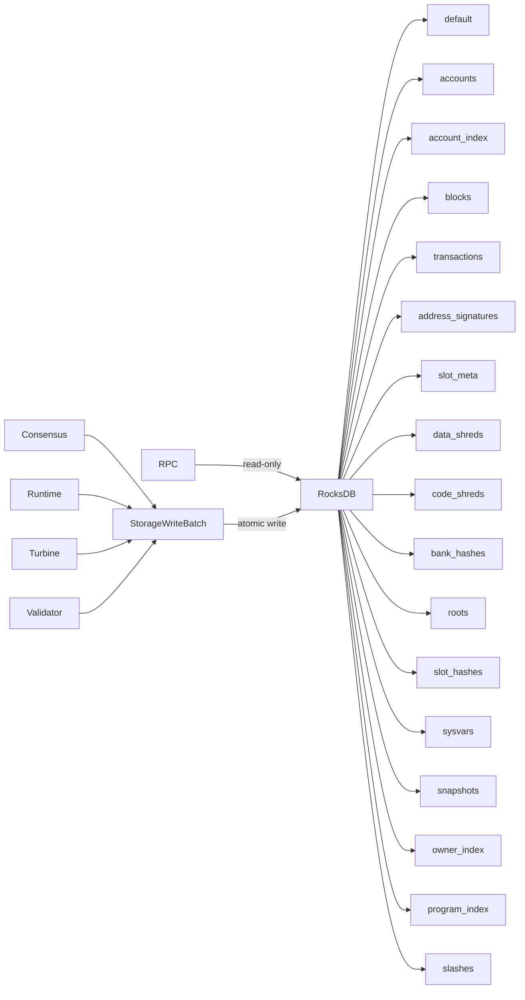

# Storage Layer

Nusantara uses RocksDB as its persistent storage backend. The storage layer
provides atomic writes across multiple column families, historical account
queries, shred storage for Turbine, and sysvar persistence.

## Architecture



---

## Column Families

The database is partitioned into **17 column families**, each storing a distinct
data type with its own key format.

| CF Name | Key Format | Key Size (bytes) | Value Type | Purpose |
|---------|-----------|-----------------|-----------|---------|
| `default` | string keys | variable | mixed | Genesis markers, validator info |
| `accounts` | Hash(64) + slot(8 BE) | 72 | Account (Borsh) | Historical account states |
| `account_index` | Hash(64) | 64 | slot(8 BE) | Latest slot for O(1) lookup |
| `blocks` | slot(8 BE) | 8 | Block (Borsh) | Block data |
| `transactions` | Hash(64) | 64 | TransactionStatusMeta (Borsh) | Transaction status and metadata |
| `address_signatures` | Hash(64) + slot(8) + tx_index(4) | 76 | () | Signatures by address |
| `slot_meta` | slot(8 BE) | 8 | SlotMeta (Borsh) | Slot metadata (parent, status) |
| `data_shreds` | slot(8) + index(4) | 12 | DataShred (Borsh) | Turbine data shreds |
| `code_shreds` | slot(8) + index(4) | 12 | CodeShred (Borsh) | Turbine erasure shreds |
| `bank_hashes` | slot(8 BE) | 8 | Hash(64) | Bank hash per slot |
| `roots` | slot(8 BE) | 8 | () | Finalized (root) slots |
| `slot_hashes` | `"current"` | variable | Vec<(slot, Hash)> (Borsh) | Recent slot-to-hash mapping |
| `sysvars` | sysvar key string | variable | Sysvar (Borsh) | Sysvar state (Clock, Rent, etc.) |
| `snapshots` | slot(8 BE) | 8 | SnapshotManifest (Borsh) | Snapshot metadata |
| `owner_index` | owner_hash(64) + account_addr(64) | 128 | () | Accounts by owner |
| `program_index` | program_hash(64) + account_addr(64) | 128 | () | Accounts by program |
| `slashes` | validator_hash(64) + slot(8 BE) | 72 | SlashProof (Borsh) | Double-vote evidence |

---

## Key Encoding

All keys use **fixed-width binary encoding** with big-endian byte order for
numeric fields (slot, index). This is critical for two reasons:

1. **Prefix iteration:** RocksDB prefix extractors are configured on column
   families that need efficient range scans. Fixed-width keys ensure that a
   prefix scan on the first N bytes always groups related records together.
2. **No Borsh length-prefixes:** Borsh prepends a 4-byte length to variable-size
   fields. Keys avoid Borsh encoding so that prefix extractors work on raw byte
   boundaries.

### Prefix Extractors

| Column Family | Prefix Length | Groups By |
|---------------|--------------|-----------|
| `accounts` | 64 bytes | Account address |
| `address_signatures` | 64 bytes | Account address |
| `data_shreds` | 8 bytes | Slot number |
| `code_shreds` | 8 bytes | Slot number |
| `owner_index` | 64 bytes | Owner address |
| `program_index` | 64 bytes | Program address |
| `slashes` | 64 bytes | Validator identity |

---

## Account Versioning

Nusantara stores **every historical version** of an account, keyed by
`(address, slot)`. This enables time-travel queries while keeping current-state
lookups fast.

### Two-CF Design

- **`account_index`** stores only the latest slot number for each account
  address. A current-state lookup is a single point read on `account_index`
  followed by a point read on `accounts`. This is O(1).
- **`accounts`** stores the full `Account` struct at every slot where the account
  was modified. Historical queries use `get_account_at_slot(address, slot)`,
  which performs a prefix scan on the address and seeks to the largest slot less
  than or equal to the requested slot.

### Query Patterns

| Operation | Method | Complexity |
|-----------|--------|------------|
| Current account state | `get_account(address)` | O(1) two point reads |
| Account at specific slot | `get_account_at_slot(address, slot)` | O(log N) seek |
| Account history | `get_account_history(address, limit)` | O(limit) prefix scan |
| Accounts by owner | prefix scan on `owner_index` | O(N) where N = accounts owned |
| Accounts by program | prefix scan on `program_index` | O(N) where N = accounts for program |
| Signatures by address | prefix scan on `address_signatures` | O(N) where N = signatures |

---

## Atomic Writes

`StorageWriteBatch` wraps a RocksDB `WriteBatch` and exposes typed methods for
each column family:

```
let mut batch = StorageWriteBatch::new();
batch.put_account(address, slot, &account);
batch.put_account_index(address, slot);
batch.put_owner_index(owner, address);
batch.put_block(slot, &block);
batch.put_bank_hash(slot, &hash);
batch.put_root(slot);
storage.write(batch)?;
```

A single `write()` call applies all operations atomically. If the process
crashes mid-write, RocksDB's write-ahead log ensures either all or none of the
operations are persisted.

This is used extensively during block finalization, where accounts, blocks,
transaction statuses, bank hashes, and roots must all be committed together.

---

## Pruning

Validators can limit disk usage by pruning old ledger data.

### Configuration

```
nusantara-validator --max-ledger-slots=256
```

- **`--max-ledger-slots=N`:** Retains only the most recent N slots of block,
  shred, and transaction data. Default: **256**.
- **`--max-ledger-slots=0`:** Disables pruning entirely (archive node).

### What Gets Pruned

| Column Family | Pruned? | Notes |
|---------------|---------|-------|
| `blocks` | Yes | Old blocks removed |
| `data_shreds` | Yes | Old shreds removed |
| `code_shreds` | Yes | Old shreds removed |
| `slot_meta` | Yes | Old metadata removed |
| `transactions` | Yes | Old tx status removed |
| `address_signatures` | Yes | Old signatures removed |
| `accounts` | Partial | Only superseded versions; latest version always kept |
| `bank_hashes` | Yes | Old bank hashes removed |
| `roots` | No | Root markers are cheap, retained indefinitely |
| `sysvars` | No | Always current, single version |
| `account_index` | No | Always current, single version |
| `owner_index` | No | Always current |
| `program_index` | No | Always current |
| `slashes` | No | Retained for governance evidence |

### Pruning Process

Pruning runs after each slot is finalized as a root:

1. Determine the oldest slot to retain: `current_root - max_ledger_slots`.
2. For each prunable column family, delete all keys with slot less than the
   cutoff using range deletes.
3. For `accounts`, only delete versions where a newer version exists for the
   same address at a slot within the retention window.

---

## Snapshots

Snapshots capture a consistent point-in-time image of the validator state for
fast bootstrap.

### Configuration

```
nusantara-validator --snapshot-interval=1000
```

- **`--snapshot-interval=N`:** Create a snapshot every N slots. Default: disabled
  (0).

### SnapshotManifest

Stored in the `snapshots` column family, keyed by slot:

| Field | Type | Description |
|-------|------|-------------|
| slot | u64 | Slot number of the snapshot |
| bank_hash | Hash | Bank hash at this slot |
| accounts_hash | Hash | Merkle root of all account states |
| num_accounts | u64 | Total number of accounts |
| lamports_total | u64 | Total lamports in circulation |
| created_at | u64 | Unix timestamp of creation |

### Download

New validators can download a snapshot from an existing validator:

```
GET /v1/snapshot/download
```

This returns a compressed archive of all accounts and metadata at the snapshot
slot, allowing the new validator to skip replaying the entire ledger history.

---

## Storage Initialization

On first boot, the storage layer:

1. Opens (or creates) the RocksDB database at the configured data directory.
2. Creates all 17 column families with their respective options and prefix
   extractors.
3. Checks for the `GENESIS_HASH_KEY` marker in `CF_DEFAULT`.
   - If absent, genesis has not been applied. The genesis builder writes initial
     state.
   - If present, the validator resumes from the stored state.

The genesis marker ensures idempotent initialization --- restarting a validator
never re-applies genesis.

---

## Performance Considerations

- **Write amplification:** RocksDB's LSM tree design means writes are amplified
  during compaction. The column family separation keeps hot data (accounts,
  blocks) from interfering with cold data (slashes, snapshots) during
  compaction.
- **Read performance:** Point reads on `account_index` and `accounts` are
  served from the block cache. Prefix scans use bloom filters on the prefix
  extractor to skip irrelevant SST files.
- **Memory:** RocksDB block cache is shared across all column families. The
  default size is tuned for validators with 8+ GiB of RAM.
- **Compression:** LZ4 compression is enabled for all column families except
  `data_shreds` and `code_shreds` (already compact binary data with no
  redundancy due to erasure coding).
