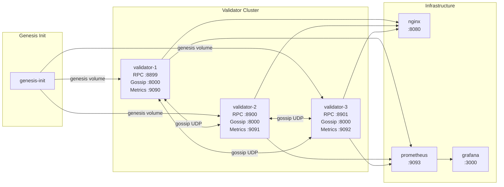

# Docker-Based Devnet Setup

Run a 3-validator Nusantara devnet locally using Docker Compose. This is the fastest way to test multi-node consensus, gossip, and turbine block propagation.

## Architecture



## Prerequisites

- Docker Engine 20.10+
- Docker Compose v2

Verify your installation:

```bash
docker --version
docker compose version
```

## Start the Devnet

From the project root:

```bash
docker compose up -d
```

This command:

1. Builds the validator image using a multi-stage Dockerfile with `cargo-chef` for dependency caching
2. Runs `genesis-init` to generate 3 validator keypairs and apply the genesis configuration
3. Starts 3 validator nodes, each copying the genesis ledger from a shared volume
4. Starts nginx (load balancer), Prometheus (metrics), and Grafana (dashboards)

First build takes approximately 5-10 minutes. Subsequent builds with cached dependencies take around 30 seconds.

## Access Points

| Service | URL | Description |
|---------|-----|-------------|
| Validator 1 RPC | http://localhost:8899 | Primary RPC endpoint |
| Validator 2 RPC | http://localhost:8900 | Secondary RPC endpoint |
| Validator 3 RPC | http://localhost:8901 | Tertiary RPC endpoint |
| Load Balancer | http://localhost:8080 | Nginx round-robin across all validators |
| Prometheus | http://localhost:9093 | Metrics aggregation dashboard |
| Grafana | http://localhost:3000 | Monitoring dashboards (user: `admin`, password: `nusantara`) |
| Swagger UI | http://localhost:8899/swagger-ui/ | Interactive API documentation |

## Genesis Configuration

The default `genesis.toml` included in the Docker image creates:

- **3 validators**, each with 500 NUSA initial stake and 10% commission
- **Faucet** pre-funded with 1,000,000,000 NUSA for development and testing

```toml
[cluster]
name = "nusantara-devnet"

[epoch]
slots_per_epoch = 432000

[[validators]]
identity = "generate"
vote_account = "derive"
stake_lamports = 500_000_000_000
commission = 10

[[validators]]
identity = "generate"
vote_account = "derive"
stake_lamports = 500_000_000_000
commission = 10

[[validators]]
identity = "generate"
vote_account = "derive"
stake_lamports = 500_000_000_000
commission = 10

[faucet]
address = "generate"
lamports = 1_000_000_000_000_000_000
```

## How It Works

### Genesis Initialization

The `genesis-init` container runs first (other containers depend on it via `service_completed_successfully`). It:

1. Generates identity keypairs for all 3 validators
2. Applies the genesis configuration to create slot 0
3. Writes the genesis ledger and keypairs to the `genesis-data` shared volume
4. Exits after completion

### Validator Startup

Each validator container:

1. Copies the genesis ledger from the read-only `genesis-data` volume
2. Selects its keypair based on the `VALIDATOR_NUM` environment variable (1, 2, or 3)
3. Discovers peers via `--entrypoints` flags pointing to the other validators' gossip ports
4. Begins participating in consensus and block production

The `--public-host` flag tells each validator to advertise its Docker service name (e.g., `validator-1`) as its externally reachable address, since the bind address `0.0.0.0` is not routable between containers.

### Networking

All containers share the `nusantara` bridge network. Validators communicate via:

- **Gossip (UDP :8000)** -- Peer discovery and cluster state (CRDS protocol)
- **Turbine (UDP :8001)** -- Shred-based block propagation with erasure coding
- **TPU (QUIC :8003)** -- Transaction ingress from clients

## Verify the Cluster

### Health Checks

```bash
# Check all three validators
curl -s http://localhost:8899/v1/health | jq
curl -s http://localhost:8900/v1/health | jq
curl -s http://localhost:8901/v1/health | jq
```

### Slot Progression

Verify that slots are advancing (one every 400ms):

```bash
curl -s http://localhost:8899/v1/slot | jq
sleep 2
curl -s http://localhost:8899/v1/slot | jq
```

### List Validators

```bash
curl -s http://localhost:8899/v1/validators | jq
```

This should return information about all 3 validators in the cluster.

### View a Block

```bash
curl -s http://localhost:8899/v1/block/0 | jq
```

### Check Epoch Info

```bash
curl -s http://localhost:8899/v1/epoch | jq
```

## Use the CLI with the Devnet

### Option 1: Local Binary

If you have built from source:

```bash
./target/release/nusantara config set --url http://localhost:8899
./target/release/nusantara keygen -o my-key.key
./target/release/nusantara airdrop 10
./target/release/nusantara balance
```

### Option 2: Docker Exec

Run the CLI inside one of the validator containers:

```bash
docker exec -it nusantara-validator-1 nusantara config set --url http://localhost:8899
docker exec -it nusantara-validator-1 nusantara keygen -o /tmp/my-key.key
docker exec -it nusantara-validator-1 nusantara airdrop 10
docker exec -it nusantara-validator-1 nusantara balance
```

### Transfer Tokens

```bash
# Generate a second keypair
./target/release/nusantara keygen -o recipient.key

# Airdrop to the first key, then transfer
./target/release/nusantara airdrop 10
./target/release/nusantara transfer <RECIPIENT_ADDRESS> 2.5
```

### Use the Load Balancer

Point the CLI at the nginx load balancer for round-robin distribution across validators:

```bash
./target/release/nusantara config set --url http://localhost:8080
./target/release/nusantara slot
```

## Monitoring

### Prometheus

Open http://localhost:9093 and query metrics such as:

- `blocks_produced` -- Total blocks produced per validator
- `current_slot` -- Current slot on each validator
- `block_time_ms` -- Block production latency
- `transactions_per_slot` -- Transaction throughput

### Grafana

Open http://localhost:3000 and log in with:

- **Username:** `admin`
- **Password:** `nusantara`

Pre-configured dashboards are provisioned from `monitoring/grafana/dashboards/`.

## Common Operations

### View Logs

```bash
# All services
docker compose logs -f

# Specific validator
docker compose logs -f validator-1

# Last 100 lines
docker compose logs --tail 100 validator-2
```

### Restart a Single Validator

```bash
docker compose restart validator-2
```

### Rebuild After Code Changes

Use the cached build for fast iteration:

```bash
docker compose build      # ~30 seconds with cache
docker compose up -d
```

Only use `--no-cache` when debugging build issues or updating base images:

```bash
docker compose build --no-cache   # ~5-10 minutes
```

### Tear Down

Remove all containers and volumes (this destroys all ledger data):

```bash
docker compose down -v
```

Remove containers but keep volumes (preserves ledger data for restart):

```bash
docker compose down
```

### Reset Ledger State

To start fresh without rebuilding images:

```bash
docker compose down -v
docker compose up -d
```

## Port Mapping Summary

| Host Port | Container Port | Service | Protocol |
|-----------|---------------|---------|----------|
| 8899 | 8899 | Validator 1 RPC | HTTP |
| 8900 | 8899 | Validator 2 RPC | HTTP |
| 8901 | 8899 | Validator 3 RPC | HTTP |
| 9090 | 9090 | Validator 1 Metrics | HTTP |
| 9091 | 9090 | Validator 2 Metrics | HTTP |
| 9092 | 9090 | Validator 3 Metrics | HTTP |
| 8080 | 80 | Nginx Load Balancer | HTTP |
| 9093 | 9090 | Prometheus | HTTP |
| 3000 | 3000 | Grafana | HTTP |

## Troubleshooting

### Validators Not Connecting

Check that gossip is working:

```bash
docker compose logs validator-1 2>&1 | grep -i gossip
```

Ensure all containers are on the same Docker network:

```bash
docker network inspect chain_nusantara
```

### Genesis Init Fails

Check the init container logs:

```bash
docker compose logs genesis-init
```

Common causes:
- Missing `genesis.toml` (should be copied into the image at build time)
- Volume permission issues on the host

### Slow Block Production

Check Prometheus metrics for `block_time_ms`. If consistently above 400ms, check container resource limits:

```bash
docker stats
```

### Port Conflicts

If a port is already in use, modify the host port in `docker-compose.yml`:

```yaml
ports:
  - "9899:8899"   # Use 9899 on host instead of 8899
```

## Next Steps

- [Quick start: build from source and run locally](./quickstart.md)
- [Write and deploy a WASM smart contract](./writing-contracts.md)
