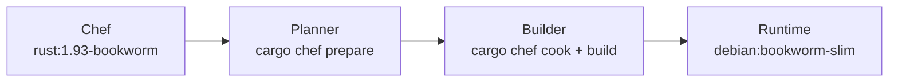
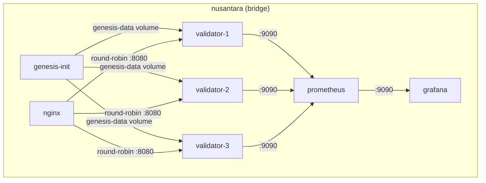

# Deployment Guide

This document covers Docker-based deployment for the Nusantara blockchain validator cluster.

## Docker Multi-Stage Build

The Dockerfile uses a 4-stage build optimized with `cargo-chef` for maximum layer caching.



### Stage 1: Chef

Base image `rust:1.93-bookworm`. Installs `cargo-chef` for dependency-aware caching.

```dockerfile
FROM rust:1.93-bookworm AS chef
RUN cargo install cargo-chef
WORKDIR /app
```

### Stage 2: Planner

Copies the full source tree and runs `cargo chef prepare`, which analyzes the workspace
and produces a `recipe.json` file containing only the dependency graph (no source code).

```dockerfile
FROM chef AS planner
COPY . .
RUN cargo chef prepare --recipe-path recipe.json
```

### Stage 3: Builder

Installs system dependencies required for native compilation, then builds in two phases:

1. `cargo chef cook --release` -- compiles all dependencies from the recipe. This layer is
   cached as long as `Cargo.toml` and `Cargo.lock` are unchanged.
2. `cargo build --release` -- compiles only the workspace source code. Only source changes
   trigger this step.

```dockerfile
FROM chef AS builder

# System dependencies for RocksDB, crypto, and QUIC
RUN apt-get update && apt-get install -y --no-install-recommends \
    libclang-dev \
    cmake \
    pkg-config \
    libssl-dev \
    && rm -rf /var/lib/apt/lists/*

# Build dependencies (cached unless Cargo.toml/Cargo.lock change)
COPY --from=planner /app/recipe.json recipe.json
RUN cargo chef cook --release --recipe-path recipe.json

# Build workspace source
COPY . .
RUN cargo build --release
```

### Stage 4: Runtime

Minimal `debian:bookworm-slim` image with only runtime dependencies. Copies the compiled
binaries, default genesis configuration, and the entrypoint script.

```dockerfile
FROM debian:bookworm-slim AS runtime

RUN apt-get update && apt-get install -y --no-install-recommends \
    ca-certificates \
    libssl3 \
    && rm -rf /var/lib/apt/lists/*

COPY --from=builder /app/target/release/nusantara-validator /usr/local/bin/
COPY --from=builder /app/target/release/nusantara /usr/local/bin/
COPY genesis.toml /etc/nusantara/genesis.toml
COPY docker/entrypoint.sh /usr/local/bin/entrypoint.sh
RUN chmod +x /usr/local/bin/entrypoint.sh

ENTRYPOINT ["entrypoint.sh"]
```

## Docker Compose Architecture



### Services

| Service | Image | Role |
|---------|-------|------|
| genesis-init | nusantara-validator | Generates 3 keypairs, applies genesis, then exits |
| validator-1 | nusantara-validator | Full validator (gossip peers: validator-2, validator-3) |
| validator-2 | nusantara-validator | Full validator (gossip peers: validator-1, validator-3) |
| validator-3 | nusantara-validator | Full validator (gossip peers: validator-1, validator-2) |
| nginx | nginx:alpine | Load balancer, round-robin RPC on port 8080 |
| prometheus | prom/prometheus | Metrics collection, scrape interval 5s |
| grafana | grafana/grafana | Dashboards, default password: `nusantara` |

### Volumes

| Volume | Purpose |
|--------|---------|
| genesis-data | Shared genesis ledger and keypairs between init and validators |
| validator1-data | Persistent ledger storage for validator 1 |
| validator2-data | Persistent ledger storage for validator 2 |
| validator3-data | Persistent ledger storage for validator 3 |

### Network

All services run on a single Docker bridge network named `nusantara`. Service names resolve
as hostnames within the network (e.g., `validator-1:8000` for gossip).

## Docker Entrypoint Script

The entrypoint script (`docker/entrypoint.sh`) handles two modes of operation:

### Init Mode (`INIT_ONLY=true`)

Used by the `genesis-init` service:

1. Generate keypairs for all 3 validators into the shared volume
2. Apply genesis configuration using the first validator's identity
3. Exit with code 0

### Normal Boot Mode

Used by each validator service:

1. Wait for the genesis ledger to appear in the shared volume (polls every 1s, timeout 60s)
2. Copy genesis ledger from shared volume to local data directory
3. Select keypair based on `VALIDATOR_NUM` environment variable (1, 2, or 3)
4. Start `nusantara-validator` with the appropriate arguments

## Validator CLI Arguments

| Argument | Default | Description |
|----------|---------|-------------|
| `--ledger-path` | `/data/ledger` | Ledger storage directory |
| `--genesis-config` | `/etc/nusantara/genesis.toml` | Path to genesis TOML config |
| `--gossip-addr` | `0.0.0.0:8000` | Gossip protocol bind address |
| `--rpc-addr` | `0.0.0.0:8899` | RPC server bind address |
| `--metrics-addr` | `0.0.0.0:9090` | Prometheus metrics bind address |
| `--enable-faucet` | `false` | Enable the airdrop faucet endpoint |
| `--max-ledger-slots` | `256` | Number of historical slots to retain |
| `--public-host` | (none) | External hostname for gossip advertisements |
| `--entrypoints` | (none) | Comma-separated gossip peer endpoints |
| `--snapshot-interval` | `0` | Slots between snapshots (0 = disabled) |
| `--rpc-tls-cert` | (none) | Path to PEM-encoded TLS certificate chain |
| `--rpc-tls-key` | (none) | Path to PEM-encoded TLS private key |

## Port Reference

| Port | Protocol | Service |
|------|----------|---------|
| 8000 | UDP | Gossip (CRDS protocol) |
| 8001 | UDP | Turbine (shred propagation) |
| 8002 | UDP | Repair (shred recovery) |
| 8003 | QUIC | TPU (transaction ingress) |
| 8004 | QUIC | TPU Forward (leader forwarding) |
| 8899 | HTTP(S) | RPC + WebSocket + Swagger UI |
| 9090 | HTTP | Prometheus metrics exporter |

All UDP and QUIC ports must be reachable between validator nodes. The RPC port (8899) is
the only port that needs to be exposed to external clients.

## TLS Configuration

The RPC server supports TLS for production deployments. Provide PEM-encoded certificate
chain and private key files:

```bash
nusantara-validator \
  --rpc-tls-cert /etc/nusantara/cert.pem \
  --rpc-tls-key /etc/nusantara/key.pem \
  --rpc-addr 0.0.0.0:8899 \
  --ledger-path /data/ledger
```

The certificate chain file should contain the server certificate followed by any
intermediate certificates. The private key file must match the server certificate.

When TLS is enabled, the RPC server listens on HTTPS. Swagger UI is available at
`https://<host>:8899/swagger-ui/`.

## Build Commands

### Cached Build (Default)

```bash
docker-compose build
# or
make build
```

Use this for regular development and CI/CD pipelines. Typical build time: ~30 seconds
when only source code has changed. The `cargo-chef` layer cache ensures that dependency
compilation is skipped unless `Cargo.toml` or `Cargo.lock` are modified.

### No-Cache Build (Rare)

```bash
docker-compose build --no-cache
# or
make build-nc
```

Typical build time: 5-10 minutes. Only use when:

- Debugging build issues with stale layers
- Dependency corruption is suspected
- Base image updates are required
- Explicit troubleshooting demands a clean build

### Running the Cluster

```bash
# Start all services
docker-compose up -d

# View logs
docker-compose logs -f validator-1

# Stop the cluster
docker-compose down

# Stop and remove volumes (full reset)
docker-compose down -v
```

### Scaling Notes

The default compose file runs 3 validators. To add more:

1. Add a new validator service in `docker-compose.yml` with a unique `VALIDATOR_NUM`
2. Update the `genesis-init` service to generate additional keypairs
3. Add the new validator to existing validators' `--entrypoints` lists
4. Add a new named volume for the validator's ledger data
5. Update the nginx upstream block to include the new validator
6. Add a new Prometheus scrape target

## Environment Variables

| Variable | Service | Description |
|----------|---------|-------------|
| `INIT_ONLY` | genesis-init | Set to `true` to run init mode |
| `VALIDATOR_NUM` | validator-N | Validator index (1, 2, 3) for keypair selection |
| `RUST_LOG` | all validators | Tracing filter (e.g., `info,nusantara=debug`) |
| `GENESIS_CONFIG` | genesis-init | Path to genesis TOML (default: `/etc/nusantara/genesis.toml`) |

## Production Considerations

- **Resource limits**: Set CPU and memory limits in the compose file to prevent a single
  validator from starving others on the same host.
- **Persistent storage**: Use named volumes or host-mounted directories for ledger data.
  Losing the ledger requires replaying from genesis or downloading a snapshot.
- **Firewall rules**: Open UDP ports 8000-8002 and QUIC ports 8003-8004 between validators.
  Expose only port 8899 (RPC) and 8080 (load balancer) to external clients.
- **Log rotation**: Configure Docker log rotation to prevent disk exhaustion. Use
  `json-file` driver with `max-size` and `max-file` options.
- **Monitoring**: Always deploy with Prometheus and Grafana. See
  [monitoring.md](monitoring.md) for metrics catalog and alerting recommendations.
