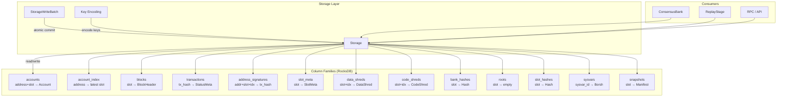
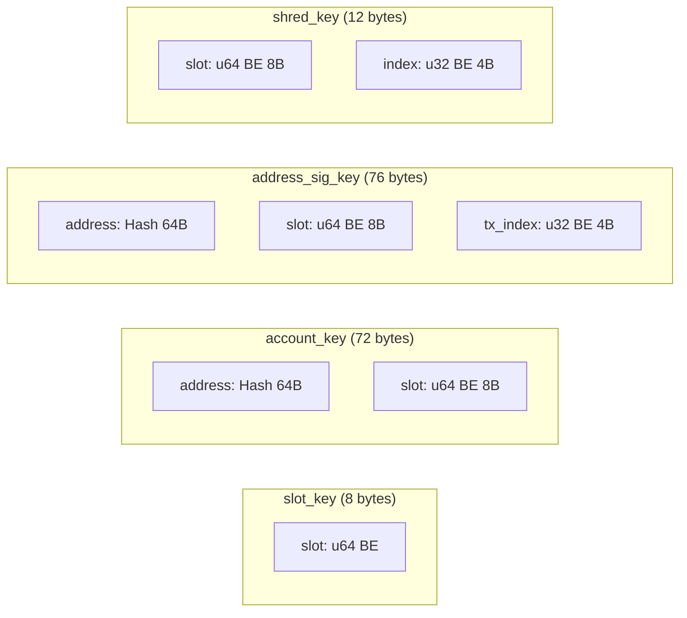
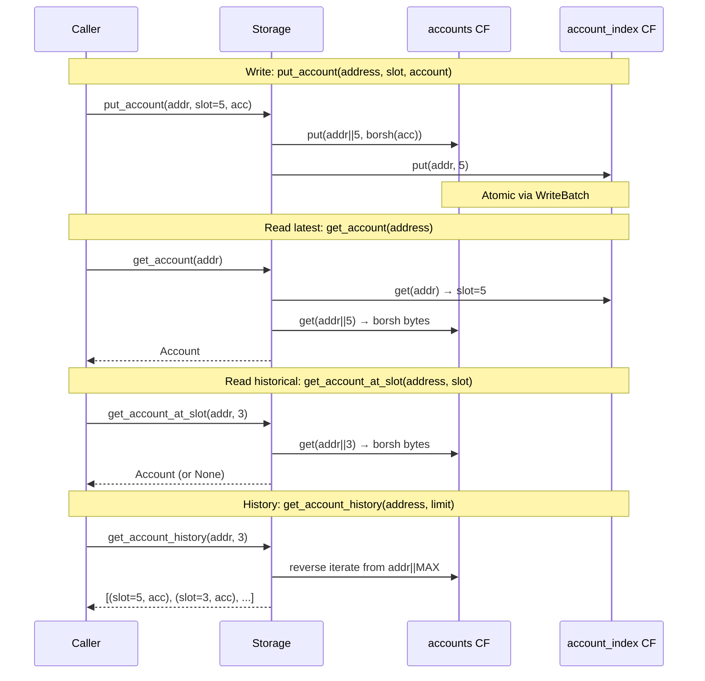
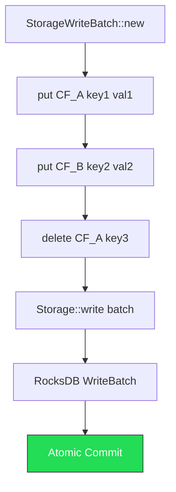
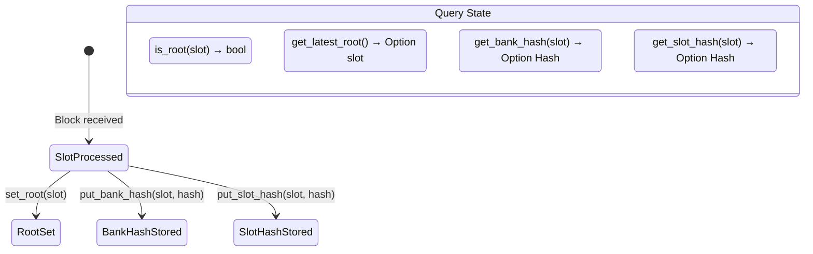

# Storage Architecture

## System Overview



## Key Encoding



All keys use big-endian encoding to preserve natural ordering in RocksDB's lexicographic key space.

## Account Storage Model



## Write Batch Flow



## Prefix Iteration

```mermaid
graph TD
    subgraph "accounts CF (prefix = 64-byte address)"
        A1["addr_A || slot_1 → acc_v1"]
        A2["addr_A || slot_5 → acc_v2"]
        A3["addr_A || slot_9 → acc_v3"]
        B1["addr_B || slot_2 → acc_v1"]
        B2["addr_B || slot_7 → acc_v2"]
    end

    Q[get_account_history addr_A limit=2] -->|reverse from addr_A||MAX| A3
    A3 --> A2
    A2 -->|limit reached| STOP[Return 2 results]

    style Q fill:#fa0,stroke:#333,color:#fff
    style STOP fill:#2d5,stroke:#333,color:#fff
```

## Consensus State (bank.rs)



## Data Flow Summary

| Component | Input | Output | Key Format |
|-----------|-------|--------|------------|
| Account Storage | address, slot, Account | Latest or historical Account | addr(64) ++ slot(8) |
| Block Storage | BlockHeader | Header by slot, range queries | slot(8) |
| Transaction Storage | tx_hash, StatusMeta | Status by hash, sigs by address | tx_hash(64) / addr(64)+slot(8)+idx(4) |
| Shred Storage | DataShred / CodeShred | Shreds by slot+index or all per slot | slot(8) ++ index(4) |
| Slot Meta | SlotMeta | Metadata by slot | slot(8) |
| Bank State | slot, hash | Roots, bank hashes, slot hashes | slot(8) |
| Snapshots | SnapshotManifest | Manifest by slot, latest | slot(8) |
| Sysvars | Sysvar impl | Sysvar by type ID | sysvar_id(64) |
